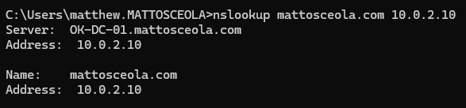
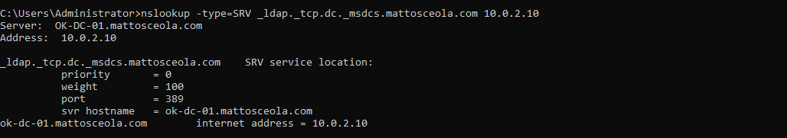
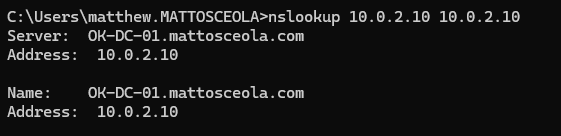

# DNS Configuration & Validation

## Overview

Configured and validated DNS on Windows Server 2022 within the `mattosceola.com` Active Directory environment. Configured forward and reverse DNS resolution and validated Active Directory DNS records used for Domain Controller discovery and name resolution.

## Environment

* **Hypervisor:** Oracle VirtualBox
* **Server:** Windows Server 2022
* **Domain Controller:** `OK-DC-01`
* **Domain:** `mattosceola.com`
* **DNS Server:** `10.0.2.10`
* **Client:** Windows 11 Pro
* **Directory Service:** Active Directory Domain Services (AD DS)

## Configuration

### DNS Manager

Used DNS Manager to configure and verify DNS zones and records on the Domain Controller.

*DNS Manager displaying the configured DNS zones and records for the Active Directory environment.*

### Forward DNS Resolution

Configured DNS to resolve the Active Directory domain:

```text
mattosceola.com
```

Forward DNS resolution allows domain clients and services to resolve the Active Directory domain to the Domain Controller's IP address.

### Reverse Lookup Zone

Created an IPv4 reverse lookup zone for the `10.0.2.0/24` network.

*Reverse lookup zone configured for the `10.0.2.0/24` network.*


### PTR Record

Created a PTR record to map the Domain Controller's IP address to its hostname.

```text
10.0.2.10 → OK-DC-01.mattosceola.com
```

This allows reverse DNS queries to resolve the Domain Controller's IP address to its fully qualified domain name.

## Validation

Validated DNS functionality using Windows network configuration tools, `nslookup`, and `dcdiag`.

### IP Configuration

Used `ipconfig /all` to verify the Domain Controller's network configuration and DNS server settings.

*Domain Controller network configuration displaying the assigned IP address and DNS server.*


### Forward DNS Resolution

Used `nslookup` to directly query the Domain Controller's DNS server and verify forward resolution of the Active Directory domain.

```text
mattosceola.com → 10.0.2.10
```

*NSLOOKUP successfully resolving the `mattosceola.com` domain to the Domain Controller.*



### Active Directory SRV Record

Verified the Active Directory LDAP SRV record used for Domain Controller discovery.

```text
_ldap._tcp.dc._msdcs.mattosceola.com
```

*DNS SRV lookup resolving the Active Directory LDAP service record.*



### Reverse DNS Resolution

Used `nslookup` to directly query the Domain Controller's DNS server and verify reverse DNS resolution.

```text
10.0.2.10 → OK-DC-01.mattosceola.com
```

*Reverse DNS lookup resolving the Domain Controller's IP address to its hostname.*



### DCDIAG DNS Validation

Used `dcdiag` to validate Domain Controller connectivity and DNS functionality.

*DCDIAG output validating Domain Controller connectivity and DNS functionality.*


