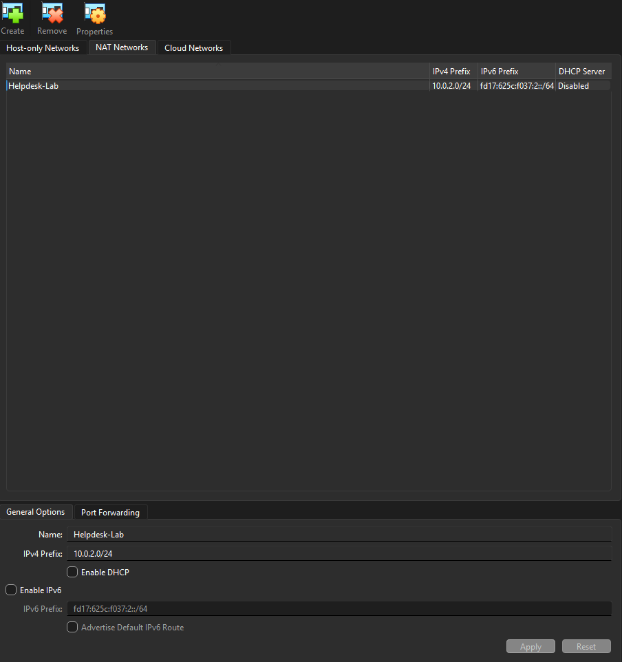
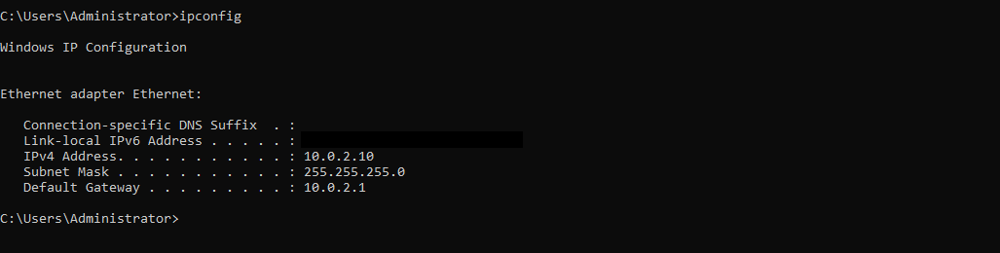

# VirtualBox NAT Network Configuration & Validation

## Overview

Configured a VirtualBox NAT Network to allow Windows Server 2022 and a Windows 11 client to communicate on the same private network while maintaining internet access. The NAT Network isolates the lab environment from the home network and allows Windows Server DHCP and DNS services to manage client networking.

## Environment

* **Hypervisor:** Oracle VirtualBox
* **Network Mode:** NAT Network
* **Server:** Windows Server 2022
* **Domain Controller:** `OK-DC-01`
* **Client:** Windows 11 Pro
* **Domain:** `mattosceola.com`
* **Server IP:** `10.0.2.10`
* **Gateway:** `10.0.2.1`
* **Subnet:** `10.0.2.0/24`

## Configuration

### NAT Network

Created a VirtualBox NAT Network to provide an isolated virtual network with internet access for the lab virtual machines.

*VirtualBox NAT Network configured for the Windows Server and Windows 11 virtual machines.*

### Virtual Machine Network Adapters

Configured both virtual machines to use the same VirtualBox NAT Network.

* Windows Server 2022
* Windows 11 Client

*Virtual machine network adapters configured to use the same NAT Network.*

### Server Network Configuration

Configured the Windows Server with a static IPv4 address for use as the Domain Controller, DNS server, and DHCP server.

Expected values:

* IPv4 Address: `10.0.2.10`
* Subnet Mask: `255.255.255.0`
* Default Gateway: `10.0.2.1`

*Windows Server network configuration showing the assigned static IPv4 address, subnet mask, and default gateway.*

## Validation

Validated the NAT Network configuration by confirming the Windows 11 client received appropriate network settings and could communicate with the Domain Controller.

Validation included:

* Correct IP address assignment
* Default gateway configuration
* DNS configuration
* Communication with the Domain Controller
* Internet connectivity

### Client Network Configuration

*Windows 11 client displaying its assigned network configuration and DNS settings.*

### Network Connectivity

Confirmed network and internet connectivity between the virtual machines and external resources.

Validation included:

* Successful web access
* Successful ping tests
* Windows Update connectivity

*Windows Server and Windows 11 client demonstrating successful network and internet connectivity.*

