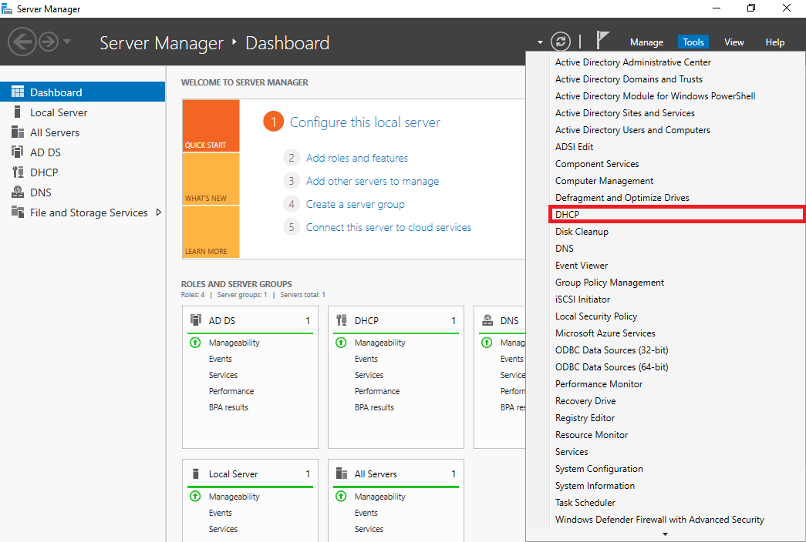
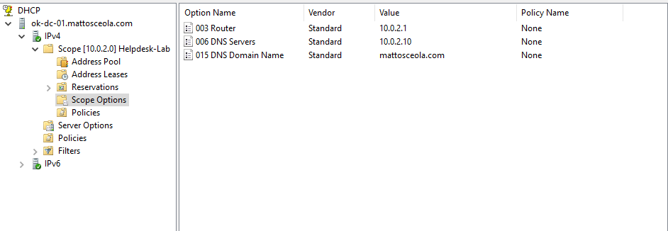
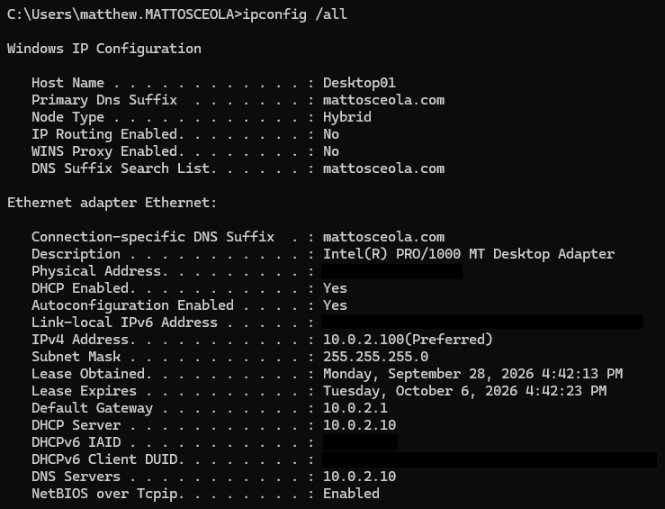

# DHCP Configuration & Validation

## Overview

Configured and validated DHCP on Windows Server 2022 within the `mattosceola.com` Active Directory environment. Configured an IPv4 DHCP scope and verified that the Windows 11 client successfully received its network configuration from the Windows Server DHCP service.

## Environment

* **Hypervisor:** Oracle VirtualBox
* **Server:** Windows Server 2022
* **Domain Controller:** `OK-DC-01`
* **Domain:** `mattosceola.com`
* **DHCP Server:** `10.0.2.10`
* **Client:** Windows 11 VM
* **Network:** `10.0.2.0/24`

## Configuration

### DHCP Server Role

Installed and configured the **DHCP Server** role on the Windows Server 2022 Domain Controller.

*Windows Server 2022 displaying the installed DHCP Server role.*

### DHCP Scope

Created an IPv4 DHCP scope for the `10.0.2.0/24` network to provide automatic IP address assignment to client devices.

*DHCP console displaying the configured IPv4 scope for the lab network.*

### DHCP Scope Configuration

Configured the DHCP scope with an appropriate IP address range and subnet mask for the virtual network.

*DHCP scope configuration displaying the configured address range and subnet mask.*

## Validation

Validated DHCP functionality by confirming that the Windows 11 client received an active lease and the expected network configuration from the DHCP server.

### DHCP Lease

Verified the active DHCP lease assigned to the Windows 11 client.

*DHCP console displaying the active lease assigned to the Windows 11 client.*

### Client IP Configuration

Used `ipconfig /all` on the Windows 11 client to verify that the client received its network configuration through DHCP.

*Windows 11 client displaying the IP address, subnet mask, gateway, and DNS configuration received from DHCP.*

