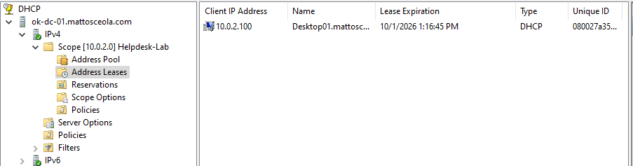
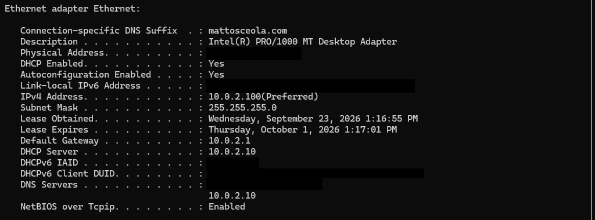

# DHCP Configuration

## Overview

Configured the Windows Server 2022 DHCP Server role to provide automatic IPv4 network configuration to Windows client machines in the home lab environment.

## Configuration

| Setting | Configuration |
|---|---|
| DHCP Server | `OK-DC-01` (Windows Server 2022) |
| Client | Windows 11 VM |
| Address Assignment | DHCP |
| Scope | 10.0.2.0/24 |
| Address Pool | 10.0.2.100 - 10.0.2.200 |
| Default Gateway | 10.0.2.1 |
| DNS Server | 10.0.2.10 |
| Lease Duration | 8 days |

## Verification

The Windows 11 client was configured to obtain its IPv4 configuration automatically.

Verification was performed using:

ipconfig /all

The DHCP lease was also verified in the DHCP management console under **Address Leases**.

Additional connectivity testing:

```text
ping 10.0.2.1  
ping 10.0.2.10  
nslookup mattosceola.com
```

## Troubleshooting

Tested DHCP functionality by renewing the client's lease:

```text
ipconfig /release  
ipconfig /renew
```

Confirmed that the Windows 11 client received the expected IPv4 address, subnet mask, gateway, and DNS server from the DHCP server.

## Evidence

### DHCP Scope


### DHCP Address Lease



### Client IP Configuration


