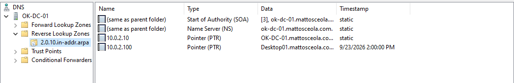
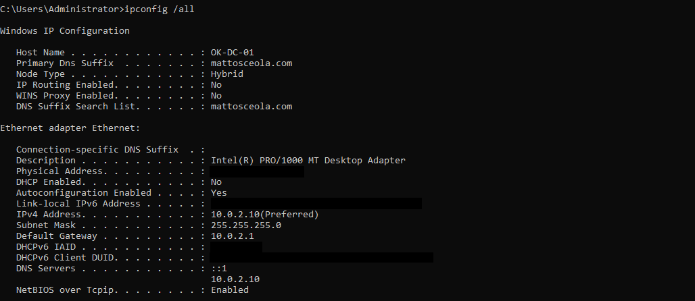
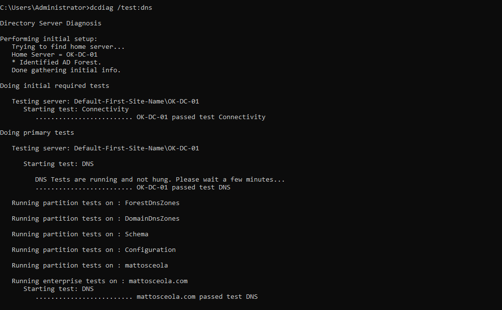

# DNS Configuration & Validation

## Overview

Configured and validated DNS on Windows Server 2022 within an Active Directory environment.

### Environment

* **Hypervisor:** Oracle VirtualBox
* **Server:** Windows Server 2022
* **Domain Controller:** `OK-DC-01`
* **Domain:** `mattosceola.com`
* **DNS Server:** `10.0.2.10`
* **Client:** Windows 11 VM


---

## DNS Configuration

### DNS Manager

Used DNS Manager to configure and verify DNS zones and records on the Domain Controller.

### Forward DNS Resolution

Configured DNS to resolve the Active Directory domain:

`mattosceola.com`

### Reverse Lookup Zone

Created an IPv4 reverse lookup zone for the `10.0.2.0/24` network.



### PTR Record

Created a PTR record to map the Domain Controller's IP address to its hostname:

`10.0.2.10` → `OK-DC-01.mattosceola.com`

---

## DNS Validation

### IP Configuration

Used `ipconfig /all` to verify the Domain Controller's network and DNS configuration.



### DNS Name Resolution

Used `nslookup` to directly query the Domain Controller's DNS server and verify forward resolution of `mattosceola.com`.

```text
mattosceola.com → 10.0.2.10
```


### Active Directory SRV Record

Verified the Active Directory LDAP SRV record used for Domain Controller discovery.

```text
_ldap._tcp.dc._msdcs.mattosceola.com
```


### Reverse DNS Resolution

Used `nslookup` to directly query the Domain Controller's DNS server and verify reverse DNS resolution of `10.0.2.10`.

```text
10.0.2.10 → OK-DC-01.mattosceola.com
```


### DCDIAG

Used `dcdiag` to validate Domain Controller connectivity and DNS functionality.


