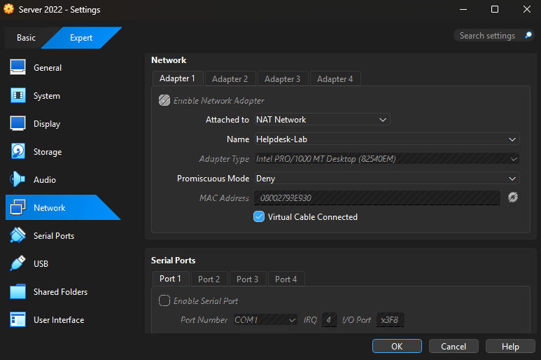
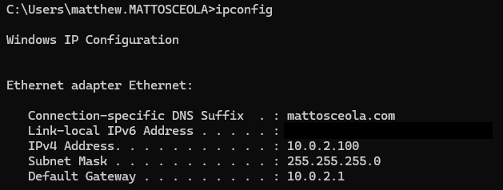
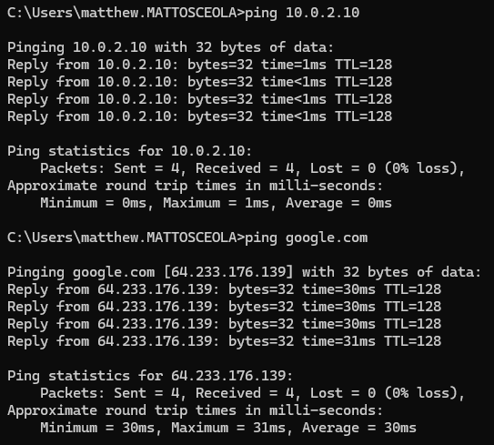

# VirtualBox NAT Network Configuration & Validation

## Overview

Configured a VirtualBox NAT Network to allow Windows Server 2022 and a Windows 11 client to communicate on the same private network while providing internet access. This isolated the lab environment from the home network and allowed Windows Server DHCP and DNS services to manage client networking.

### Environment

* **Hypervisor:** Oracle VirtualBox
* **Network Mode:** NAT Network
* **Server:** Windows Server 2022 (`OK-DC-01`)
* **Client:** Windows 11
* **Domain:** `mattosceola.com`
* **Server IP:** `10.0.2.10`
* **Gateway:** `10.0.2.1`
* **Subnet:** `10.0.2.0/24`

---

## Configuration

### Step 1: Create a NAT Network

Created a VirtualBox NAT Network to provide an isolated virtual network with internet access for both virtual machines.

---

### Step 2: Configure VM Network Adapters

Configured both virtual machines to use the same NAT Network.

* Windows Server 2022
* Windows 11 Client

---

### Step 3: Verify Server Network Configuration

Confirmed the server was using the correct static IP configuration.

Expected values:

* IPv4 Address: `10.0.2.10`
* Subnet Mask: `255.255.255.0`
* Default Gateway: `10.0.2.1`

---

## Validation

### Client Received Network Configuration

Verified the Windows 11 client received network settings and could communicate with the server.

Validation included:

* Correct IP assignment
* Default gateway present
* DNS configured
* Successful communication with the domain controller

---

### Internet Connectivity

Confirmed both virtual machines had internet access through the VirtualBox NAT Network.

Validation examples:

* Successful web access
* Successful ping tests
* Windows Update connectivity

