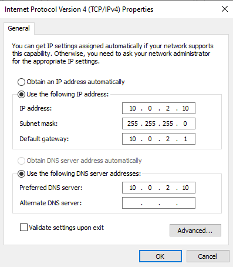
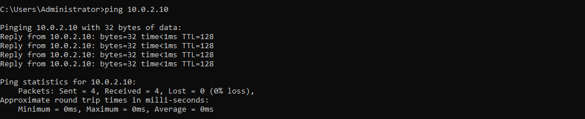
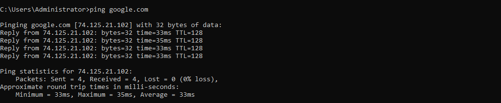

# Static IP Configuration & Validation

## Overview

Configured a static IPv4 address on a Windows Server 2022 Domain Controller to provide consistent network connectivity for Active Directory and DNS services.

### Environment

* **Hypervisor:** Oracle VirtualBox
* **Network Mode:** NAT Network
* **Server:** Windows Server 2022
* **Domain Controller:** `OK-DC-01`
* **Domain:** `mattosceola.com`
* **Static IP:** `10.0.2.10`
* **Subnet Mask:** `255.255.255.0`
* **Default Gateway:** `10.0.2.1`
* **Preferred DNS:** `10.0.2.10`

## Configuration Steps

1. Opened **Network Connections** on the Windows Server.
2. Opened the Ethernet adapter **Properties**.
3. Selected **Internet Protocol Version 4 (TCP/IPv4)**.
4. Changed the adapter from automatic addressing to **Use the following IP address**.
5. Configured:

   * IP Address: `10.0.2.10`
   * Subnet Mask: `255.255.255.0`
   * Default Gateway: `10.0.2.1`
   * Preferred DNS Server: `10.0.2.10`

6. Applied the configuration and verified the adapter retained the static settings.

## Validation

Confirmed the static configuration using Command Prompt.

### Validation checks

* Verified the server retained the configured static IPv4 address.
* Confirmed the subnet mask and default gateway matched the NAT Network configuration.
* Verified the preferred DNS server was set to the Domain Controller.
* Successfully pinged the DNS server (`10.0.2.10`).
* Successfully reached external connectivity by pinging `google.com`.

## Outcome

The Domain Controller now uses a persistent static IPv4 address, ensuring reliable communication for Active Directory, DNS, and other network services within the lab environment.

## Screenshots

### Static IPv4 Configuration

Configured the Windows Server network adapter with a static IPv4 address, subnet mask, default gateway, and preferred DNS server.

### IP Configuration Validation

Verified the static network configuration using `ipconfig /all`.

### DNS Server Connectivity

Verified connectivity to the configured DNS server using `ping 10.0.2.10`.

### Internet Connectivity

Verified external network connectivity using `ping google.com`.

