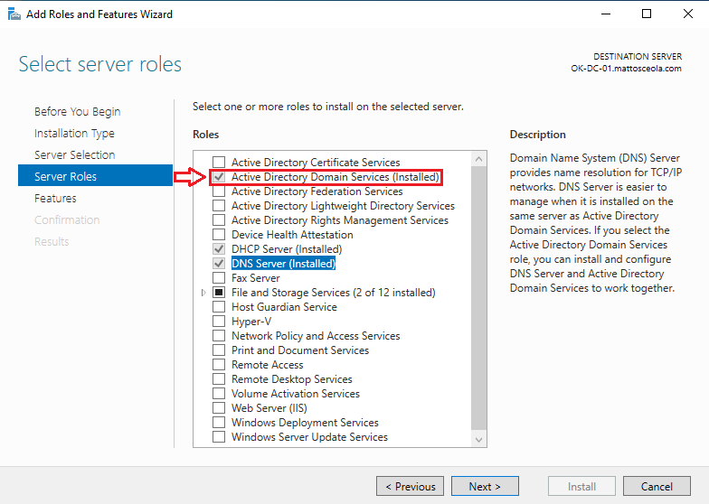
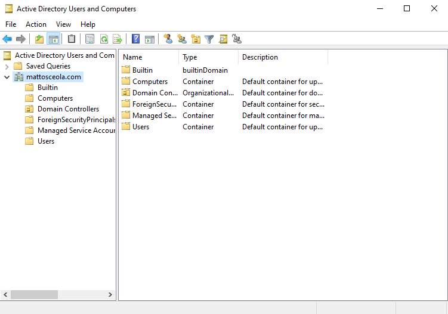
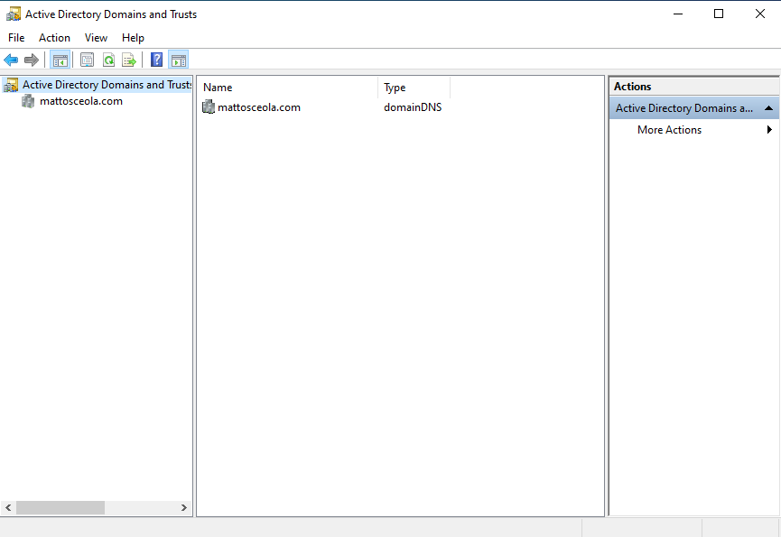
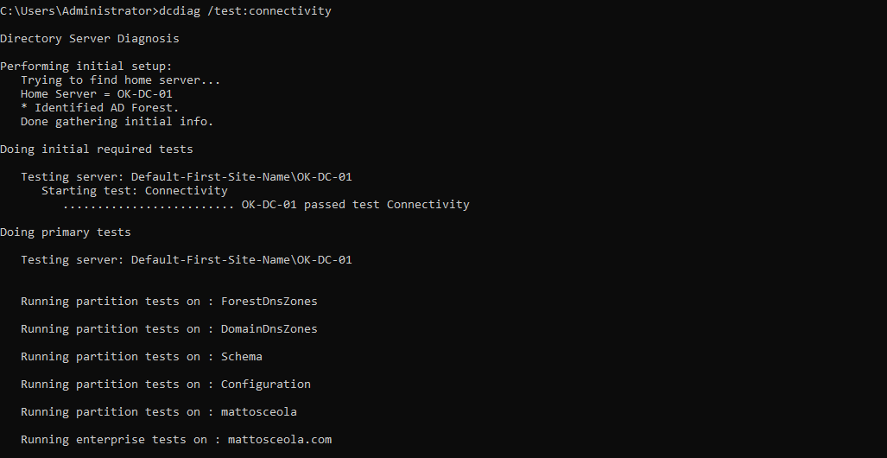
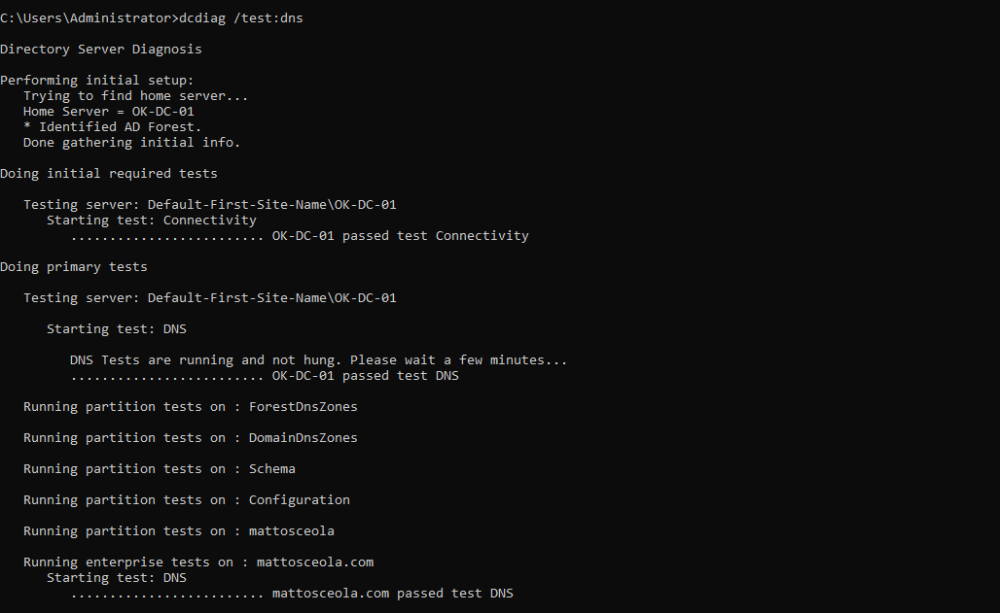
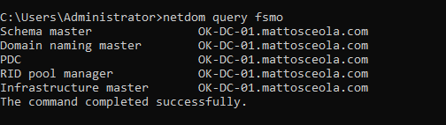

# Active Directory Domain Controller Configuration & Validation

## Overview

Configured and validated a Windows Server 2022 Domain Controller using Active Directory Domain Services (AD DS). Established the `mattosceola.com` Active Directory domain and validated Active Directory, DNS integration, Domain Controller connectivity, and FSMO role configuration.

## Environment

* **Hypervisor:** Oracle VirtualBox
* **Network:** NAT Network
* **Server:** Windows Server 2022
* **Domain Controller:** `OK-DC-01`
* **Domain:** `mattosceola.com`
* **Server IP:** `10.0.2.10`
* **Directory Service:** Active Directory Domain Services (AD DS)

## Configuration

### Active Directory Domain Services

Verified that the **Active Directory Domain Services (AD DS)** role is installed and configured on the Windows Server.

*AD DS role installed and configured on the Windows Server.*



### Active Directory Users and Computers

Verified access to the `mattosceola.com` domain through **Active Directory Users and Computers (ADUC)**.

*Active Directory Users and Computers displaying the `mattosceola.com` domain.*



### Active Directory Domains and Trusts

Verified the `mattosceola.com` domain and Active Directory forest configuration using **Active Directory Domains and Trusts**.

*Active Directory Domains and Trusts displaying the configured domain and forest.*



## Validation

### Domain Controller Health

Used `dcdiag` to validate Domain Controller connectivity and DNS functionality.

```cmd
dcdiag /test:connectivity
```

```cmd
dcdiag /test:dns
```

Validated successful Domain Controller connectivity and DNS functionality.

*DCDIAG connectivity test validating Domain Controller communication.*



*DCDIAG DNS test validating DNS functionality on the Domain Controller.*



### FSMO Role Validation

Used `netdom` to verify the Flexible Single Master Operations (FSMO) roles held by the Domain Controller.

```cmd
netdom query fsmo
```

Confirmed the expected FSMO roles are assigned to the Domain Controller.

*FSMO role assignments displayed using `netdom`.*


