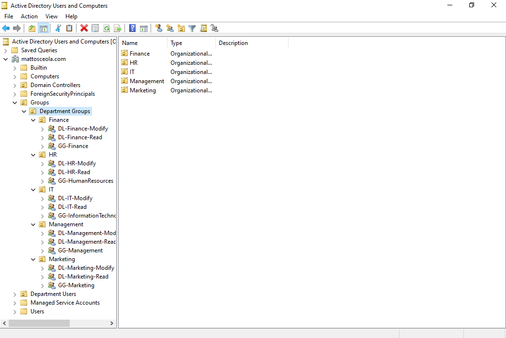
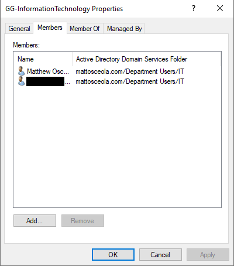
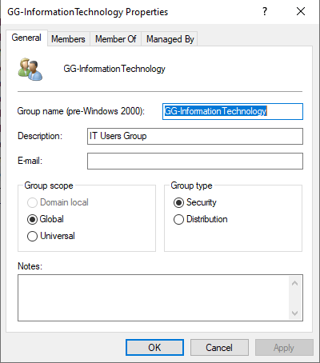

# Active Directory Groups Configuration and Validation

## Overview

Created and configured Active Directory security groups to organize users and manage access to departmental resources.

## Environment

* **Hypervisor:** Oracle VirtualBox
* **Server:** Windows Server 2022
* **Domain Controller:** `OK-DC-01`
* **Domain:** `mattosceola.com`
* **Client:** Windows 11 VM

## Configuration

Created security groups based on department and access requirements.

### Global Groups

* `GG-Finance`
* `GG-Human-Resources`
* `GG-Information-Technology`
* `GG-Marketing`
* `GG-Management`

### Domain Local Groups

* `DL-Finance-Read`
* `DL-Finance-Modify`
* `DL-Human-Resources-Read`
* `DL-Human-Resources-Modify`
* `DL-Information-Technology-Read`
* `DL-Information-Technology-Modify`
* `DL-Marketing-Read`
* `DL-Marketing-Modify`
* `DL-Management-Read`
* `DL-Management-Modify`

## Group Structure

Implemented the **AGDLP (Accounts → Global Groups → Domain Local Groups → Permissions)** model to organize access and simplify permission management.

Users are assigned to appropriate Global Groups based on their department. Global Groups are then added to Domain Local Groups that correspond to the required resource permissions.

## Validation

Verified group creation and membership through **Active Directory Users and Computers (ADUC)**.

Confirmed that users were assigned to the appropriate groups and that group memberships could be used to manage access to departmental resources.

### Active Directory Groups

### Global and Domain Local Group Membership

### Group Scope and Type

