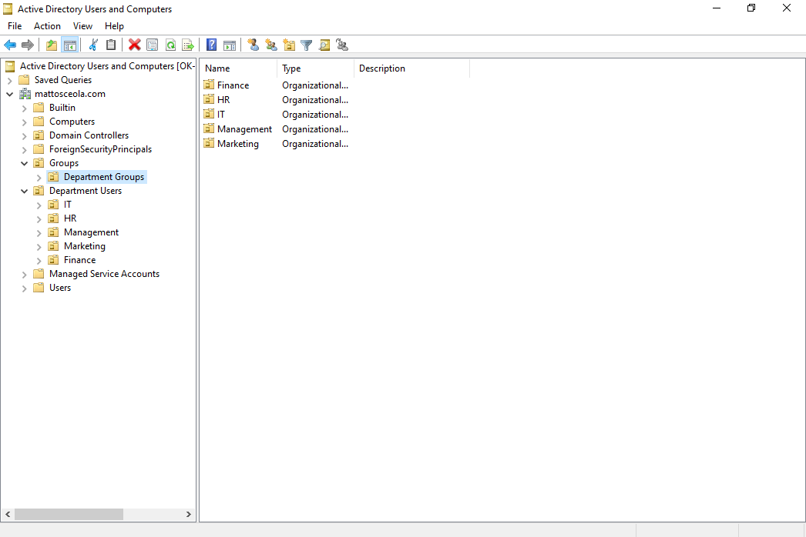
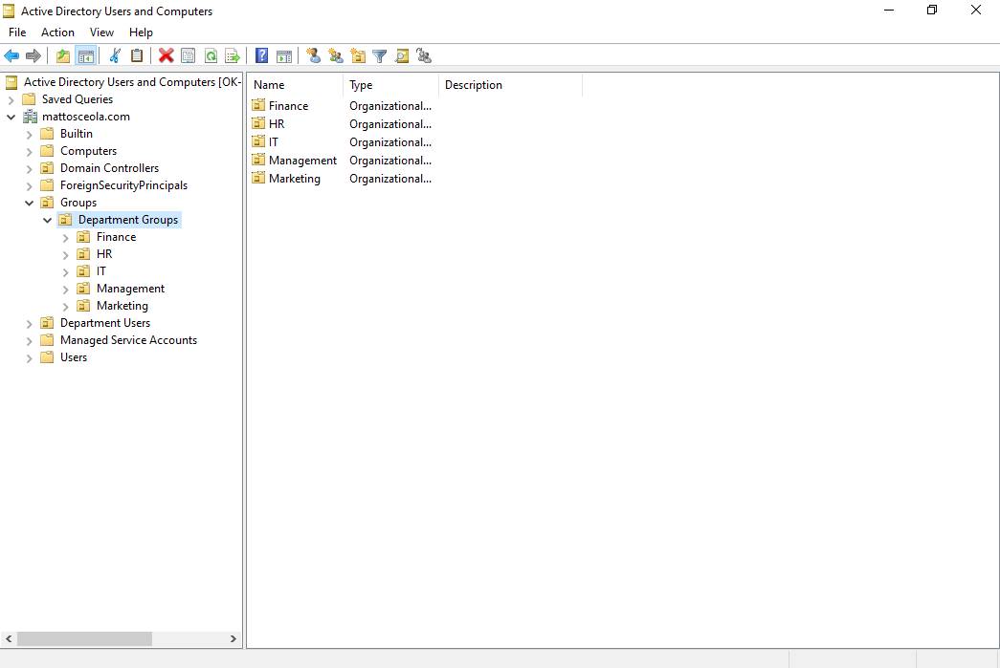
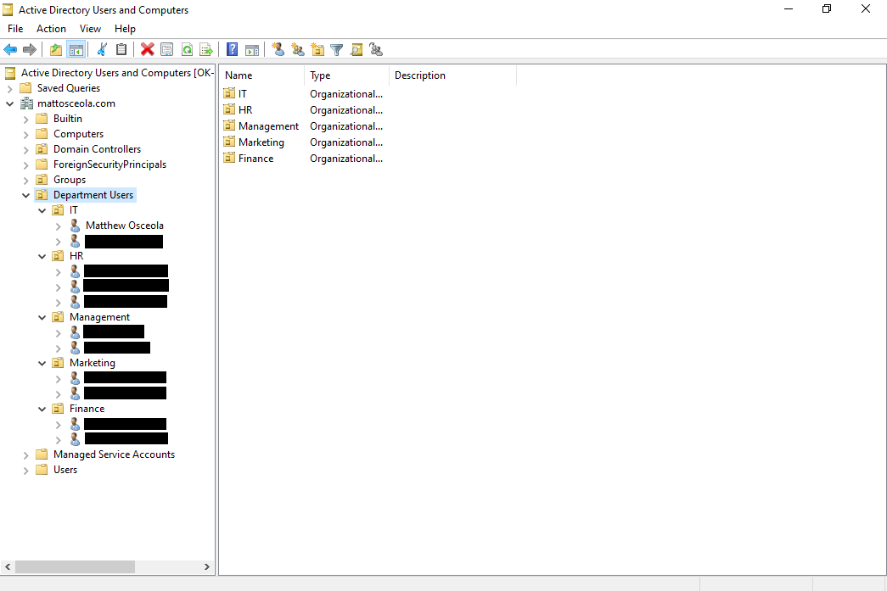
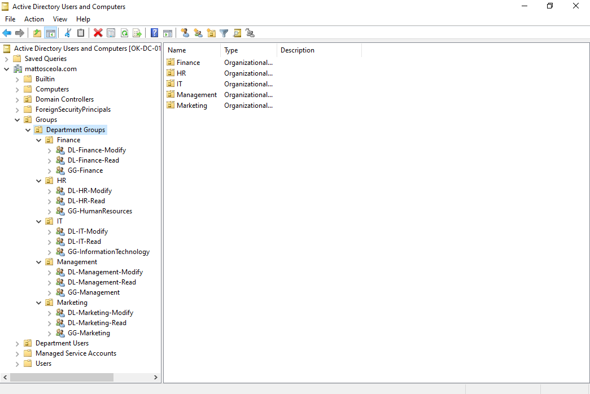
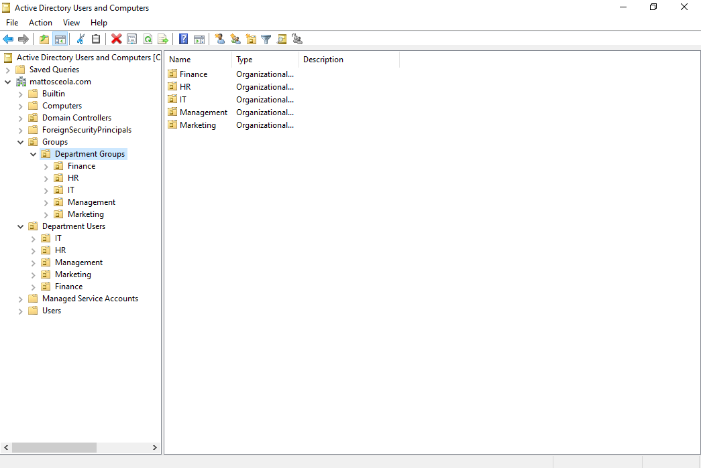

# Active Directory Organizational Units Configuration & Validation

## Overview

Created and organized Organizational Units (OUs) within the `mattosceola.com` domain to separate users, groups, computers, and departmental resources. The OU structure provides a consistent administrative hierarchy and supports centralized management through Group Policy.

## Environment

* **Hypervisor:** Oracle VirtualBox
* **Server:** Windows Server 2022
* **Domain Controller:** `OK-DC-01`
* **Domain:** `mattosceola.com`
* **Client:** Windows 11 Pro
* **Directory Service:** Active Directory Domain Services (AD DS)

## Configuration

### Organizational Unit Structure

Created top-level and departmental OUs to organize Active Directory objects by function.

Example structure:

```text
mattosceola.com
├── Department Users
│   ├── Finance
│   ├── Human Resources
│   ├── Information Technology
│   ├── Management
│   └── Marketing
├── Groups
│   └── Department Groups
└── Computers
```

### Department Organization

Created department-specific OUs to separate resources based on business function.

Departments include:

* Finance
* Human Resources
* Information Technology
* Management
* Marketing

### User Organization

Created dedicated user OUs to separate lab-created domain accounts from built-in Active Directory objects.

User accounts were placed within their appropriate departmental OUs to support organized account management and future Group Policy deployment.

### Security Group Organization

Created a dedicated Groups OU to organize department security groups separately from default Active Directory groups.

This structure supports centralized group management and the use of security groups for resource access.

## Validation

Validated the OU structure by:

* Confirming all Organizational Units were created successfully
* Verifying department users are located in their assigned OUs
* Confirming security groups are organized within the Groups OU
* Verifying built-in Active Directory objects remain separate from lab-created objects
* Confirming the OU structure is ready for Group Policy deployment

### Organizational Unit Structure

*Active Directory Users and Computers displaying the primary Organizational Units created for the lab environment.*



### Departmental Organizational Units

*Department-specific Organizational Units used to organize resources by business function.*



### User Organizational Units

*Dedicated user Organizational Units used to organize domain accounts separately from built-in Active Directory objects.*



### Security Group Organizational Units

*Groups OU containing department security groups used for centralized access management.*



### Final OU Structure

*Final Active Directory OU hierarchy showing the completed organizational structure.*


