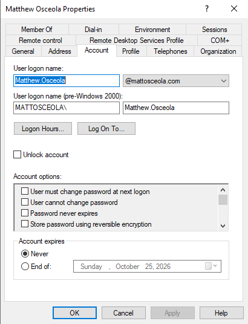
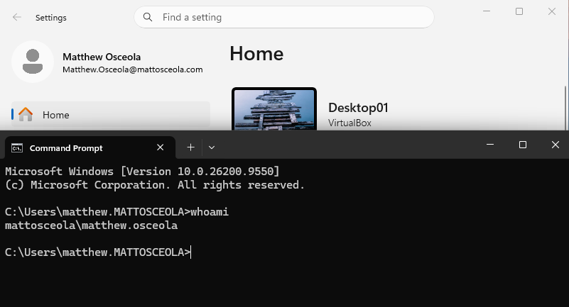

# Active Directory Users Configuration & Validation

## Overview

Created and configured Active Directory user accounts within the `mattosceola.com` domain. User accounts were organized within dedicated OUs and associated with appropriate security groups to support centralized account management and access control.

### Environment

* **Hypervisor:** Oracle VirtualBox
* **Server:** Windows Server 2022
* **Domain Controller:** `OK-DC-01`
* **Domain:** `mattosceola.com`
* **Client:** Windows 11 VM
* **Directory Service:** Active Directory Domain Services (AD DS)

## Configuration

### User Accounts

Created domain user accounts for testing and administration within the Active Directory environment.

* Configured user logon names
* Assigned user accounts to appropriate organizational units
* Configured account passwords
* Verified domain authentication
* Used domain accounts to validate Active Directory functionality

### User Organization

User accounts were separated from built-in Active Directory objects using dedicated organizational units.

Example structure:

```text
mattosceola.com
├── Users
│   ├── Department Users
│   └── ...
└── Groups
    └── Department Groups
        ├── Finance
        ├── Human Resources
        ├── Information Technology
        ├── Management
        └── Marketing
```

### Group Membership

Users were assigned to appropriate security groups based on their department and required access.

Example:

```text
User
└── GG-Finance
    └── DL-Finance-Read / DL-Finance-Modify
```

This follows the **AGDLP (Accounts → Global Groups → Domain Local Groups → Permissions)** model for managing resource access.

## Validation

Validated user account functionality by:

* Signing into the Windows 11 client using a domain account
* Confirming the account authenticated against the `mattosceola.com` domain
* Verifying the user's OU placement in Active Directory Users and Computers
* Verifying group membership
* Confirming the user's access to assigned resources

### User Accounts


### User Properties



### Group Membership


### Domain Authentication


