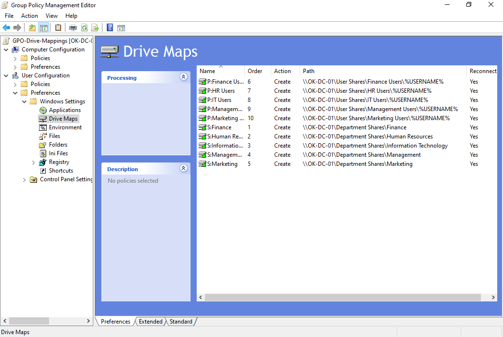
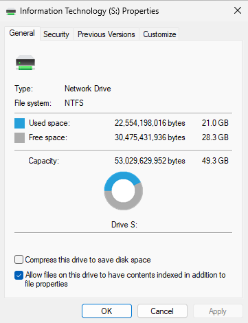
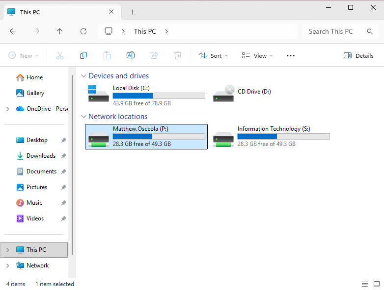
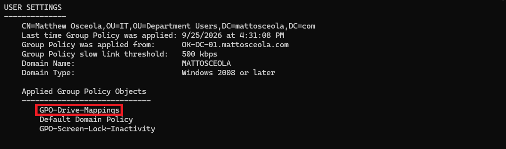

# Mapped Network Drives Configuration & Validation

## Overview

Configured Group Policy Preferences to automatically map department and personal network drives for domain users, providing consistent access to shared resources without requiring manual drive mapping.

## Environment

- **Hypervisor:** Oracle VirtualBox
- **Server:** Windows Server 2022
- **Domain Controller:** `OK-DC-01`
- **Domain:** `mattosceola.com`
- **Client:** Windows 11 Pro
- **Management Tool:** Group Policy Management

## Configuration

### Department Drive Mapping

Configured a Group Policy Preference to map the department shared folder.

- **Policy Location:** User Configuration → Preferences → Windows Settings → Drive Maps
- **Action:** Create
- **Drive Letter:** `S:`
- **Path:** `\\OK-DC-01\Department Shares\Information Technology`
- **Reconnect:** Enabled

### Personal Home Drive Mapping

Configured a second Group Policy Preference to automatically map each user's personal folder using the `%USERNAME%` environment variable.

- **Policy Location:** User Configuration → Preferences → Windows Settings → Drive Maps
- **Action:** Create
- **Drive Letter:** `P:`
- **Path:** `\\OK-DC-01\User Shares\IT Users\%USERNAME%`
- **Reconnect:** Enabled

### Group Policy Deployment

- Linked the drive mapping policy to the appropriate Organizational Unit.
- Updated Group Policy on the client with `gpupdate /force`.
- Verified that the assigned drives appeared after signing in with a domain account.

## Validation

Confirmed that:

- Department users automatically received the `S:` mapped drive.
- Users automatically received their personal `P:` drive based on `%USERNAME%`.
- Drive mappings appeared without manual configuration.
- Mapped drives remained available after signing out and back in.
- Access respected the NTFS and share permissions configured on the file server.

### Drive Maps Policy Configuration

*Group Policy Preferences showing the configuration used to deploy mapped network drives.*

### Department Drive (S:)

*The department shared drive automatically mapped for Information Technology users.*

### Personal Drive (P:)

*The personal home drive automatically mapped using the `%USERNAME%` variable.*

### File Explorer with Mapped Drives

*File Explorer showing both department and personal network drives after Group Policy was applied.*

### Group Policy Applied (`gpresult`)

*`gpresult` confirming that the mapped drive Group Policy was successfully applied to the user.*

