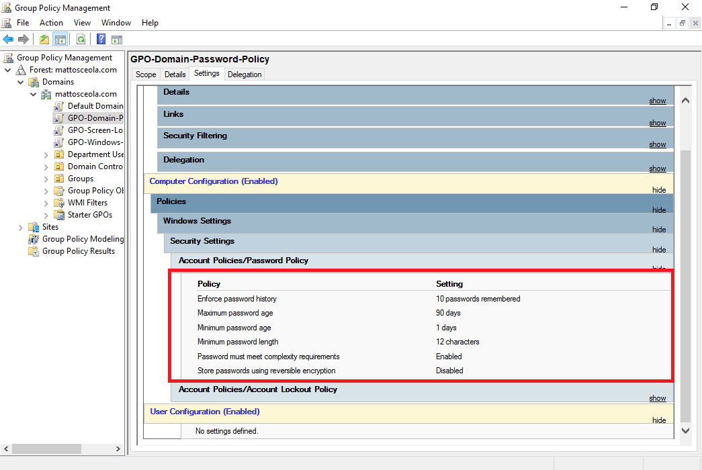
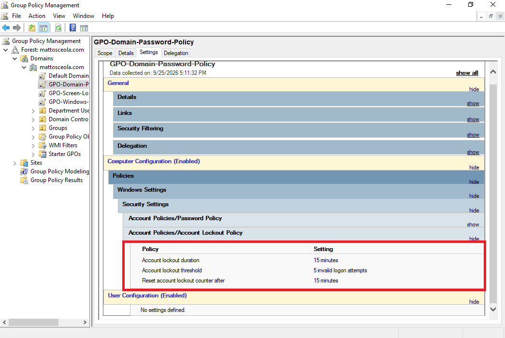
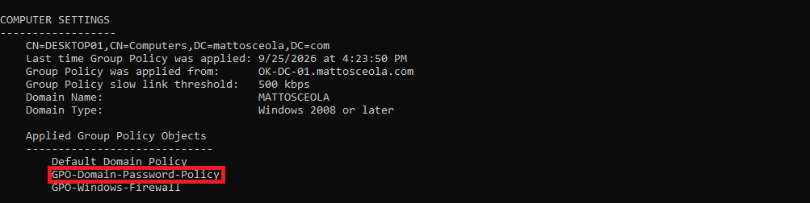

# Password & Account Lockout Configuration & Validation

## Overview

Configured domain password and account lockout policies using Group Policy in a Windows Server 2022 Active Directory environment.

The policies are designed to strengthen account security by enforcing password requirements and temporarily locking accounts after repeated failed login attempts.

## Environment

* **Hypervisor:** Oracle VirtualBox
* **Server:** Windows Server 2022
* **Domain Controller:** `OK-DC-01`
* **Domain:** `mattosceola.com`
* **Client:** Windows 11 Pro VM
* **Management Tool:** Group Policy Management

## Configuration

### Password Policy

Configured the following domain password requirements:

* Minimum password length
* Password complexity requirements
* Password history
* Maximum password age
* Minimum password age

### Account Lockout Policy

Configured account lockout settings to help protect against repeated failed authentication attempts:

* Account lockout threshold
* Account lockout duration
* Reset account lockout counter after

## Validation

Verified the configured policies using Group Policy management and client-side policy results.

Tested account security settings by confirming that the configured password and account lockout policies were applied to the Windows 11 client.

### Password Policy

### Account Lockout Policy

### Group Policy Results

