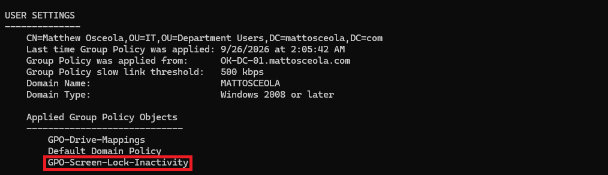

# Screen Lock & Inactivity Configuration & Validation

## Overview

Configured Group Policy to automatically enable a screen saver, lock the workstation after inactivity, and require users to authenticate when returning. The project also documents troubleshooting a policy that applied successfully but did not lock the workstation until the required registry values were configured.

## Environment

- **Hypervisor:** Oracle VirtualBox
- **Server:** Windows Server 2022
- **Domain Controller:** `OK-DC-01`
- **Domain:** `mattosceola.com`
- **Client:** Windows 11 Pro
- **Management Tool:** Group Policy Management

## Configuration

### Screen Saver and Inactivity Policy

Configured a domain Group Policy to automatically secure workstations after a period of inactivity.

- Enabled the screen saver.
- Specified the screen saver executable.
- Configured the inactivity timeout.
- Enabled password protection on resume.
- Applied the settings through Group Policy.

### Policy Deployment

Linked the policy to the appropriate Organizational Unit and updated the client to apply the new configuration.

- Linked the GPO.
- Updated Group Policy on the client with `gpupdate /force`.
- Verified policy application.

## Troubleshooting

The Group Policy appeared to apply successfully, but the workstation did not automatically lock after the inactivity timeout.

Verified that the GPO was applied using `gpresult /r` and confirmed that the screen saver settings existed. The issue was resolved by configuring the required registry values for the screen saver and secure resume behavior, after which the inactivity timeout functioned as expected.

## Validation

Confirmed that the security settings were successfully applied to the Windows 11 client.

- Screen saver started after the configured inactivity period.
- The workstation locked when the screen saver activated.
- A password was required to regain access.
- `gpresult /r` confirmed that the GPO was applied.

### Screen Saver and Inactivity Policy

*Group Policy showing the configured screen saver, inactivity timeout, and secure resume settings.*

### Group Policy Results

*`gpresult` confirming that the Screen Lock & Inactivity GPO was successfully applied to the client.*

### Locked Workstation

*Windows 11 workstation locked after the configured inactivity period, requiring domain credentials to regain access.*

