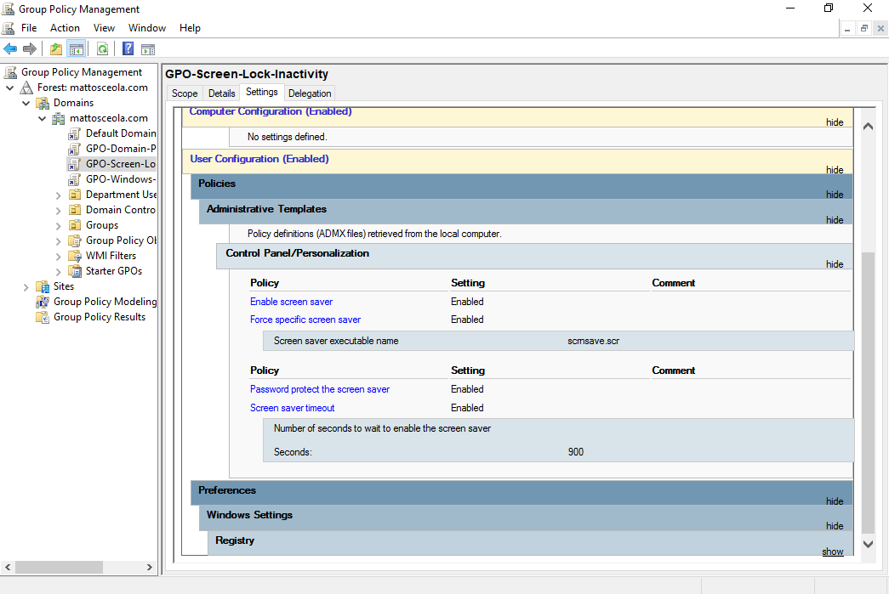
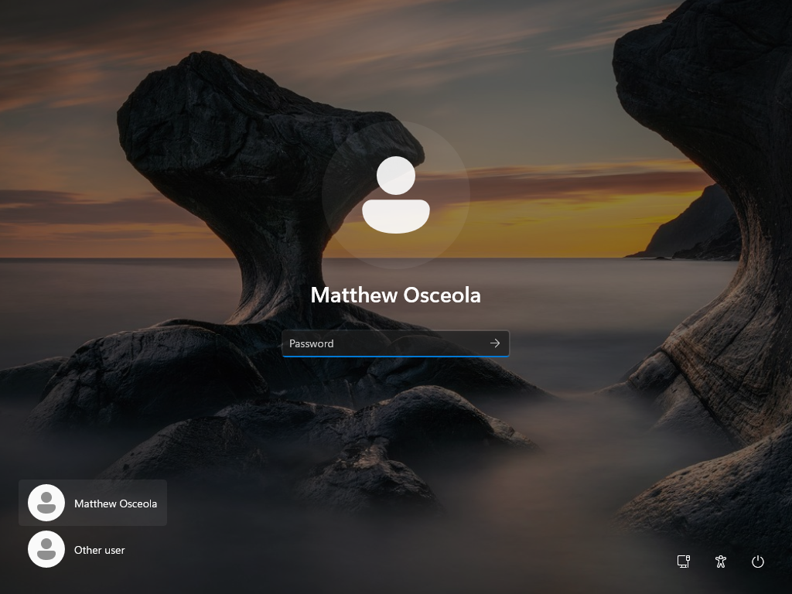

# Screen Lock & Inactivity

## Overview

This project demonstrates how Group Policy was used to automatically enable a screen saver, lock the workstation after inactivity, and require users to enter their password when returning. These settings help improve endpoint security by reducing the risk of unauthorized access when a workstation is left unattended.

## Environment

* **Hypervisor:** Oracle VirtualBox
* **Server:** Windows Server 2022
* **Domain Controller:** `OK-DC-01`
* **Domain:** `mattosceola.com`
* **Client:** Windows 11 Pro VM
* **Management Tool:** Group Policy Management

## Configuration

### Screen Saver and Inactivity Configuration

Configured a domain Group Policy to automatically enable a screen saver after a period of user inactivity and require users to authenticate when resuming from the screen saver.

- Enabled the screen saver
- Specified the screen saver executable
- Configured the inactivity timeout
- Enabled password protection on resume
- Applied the settings through Group Policy

### Policy Deployment

Linked the policy to the appropriate Organizational Unit and updated the client to apply the new configuration.

- Linked the GPO
- Updated Group Policy on the client
- Verified policy application

## Validation

Confirmed that the security settings were successfully applied to the Windows 11 client.

- Screen saver started after the configured inactivity period.
- The workstation locked when the screen saver activated.
- A password was required to regain access.
- `gpresult /r` confirmed that the GPO was applied.

### Screen Saver and Inactivity Policy

### Group Policy Results

### Locked Workstation

