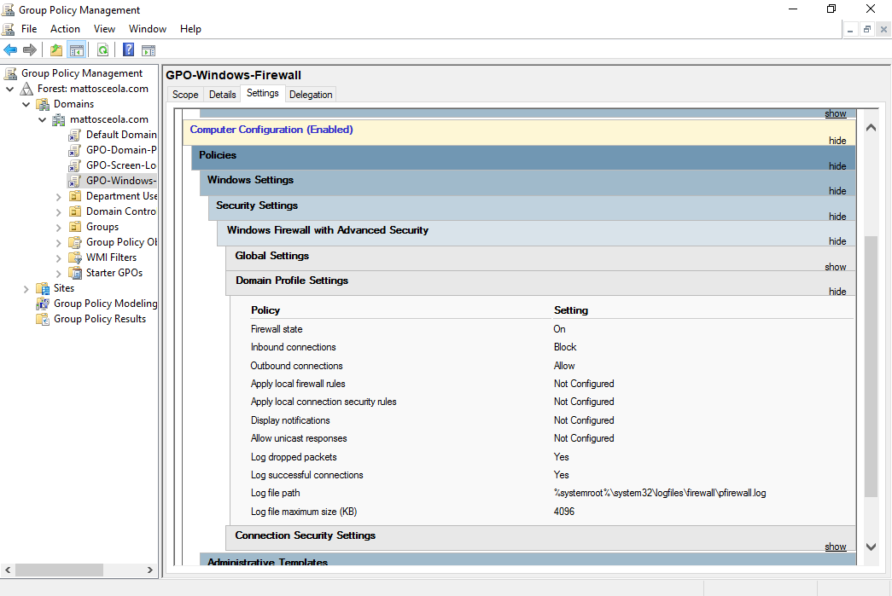
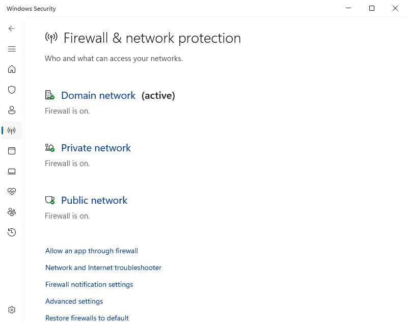
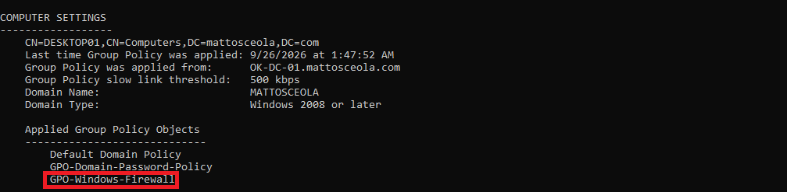

# Windows Firewall Policy Configuration & Validation

## Overview

Configured Windows Firewall settings through Group Policy to create a consistent security baseline for domain-joined computers in a simulated Windows Server 2022 help desk environment. This project demonstrates centralized firewall management using Active Directory instead of configuring each workstation individually.

## Environment

* **Hypervisor:** Oracle VirtualBox
* **Server:** Windows Server 2022
* **Domain Controller:** `OK-DC-01`
* **Domain:** `mattosceola.com`
* **Client:** Windows 11 Pro VM
* **Management Tool:** Group Policy Management

## Configuration

### Firewall Group Policy

Configured Windows Firewall settings in the **GPO-Windows-Firewall** Group Policy Object.

**Configured settings:**

- Enabled Windows Defender Firewall for the Domain Profile.
- Managed firewall settings through Group Policy.
- Applied the policy to domain-joined workstations.

### Firewall Logging

Configured Windows Defender Firewall logging for the Domain Profile to support troubleshooting and security monitoring.

**Configured settings:**

- Log dropped packets: Enabled
- Log successful connections: Enabled
- Log file: `%systemroot%\system32\logfiles\firewall\pfirewall.log`

### Policy Deployment

Linked the GPO to the appropriate Organizational Unit so domain computers receive the firewall configuration automatically during Group Policy updates.

## Validation

Verified that the firewall policy was successfully applied to the Windows 11 client.

- Confirmed the workstation received **GPO-Windows-Firewall**.
- Verified Windows Defender Firewall was enabled for the Domain Profile.
- Confirmed the Domain network profile was active.
- Verified Domain Profile logging settings were configured.

### Firewall with Logging Group Policy

### Firewall Enabled

### Group Policy Results

