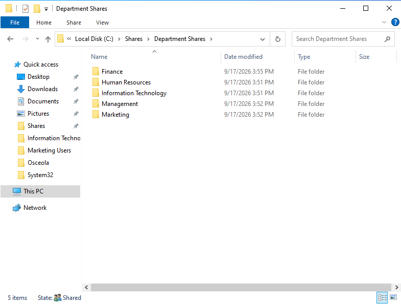
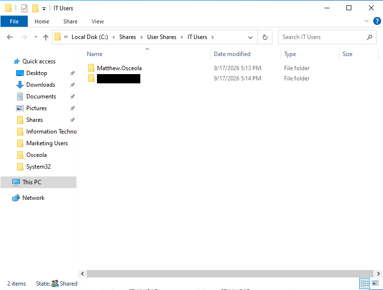
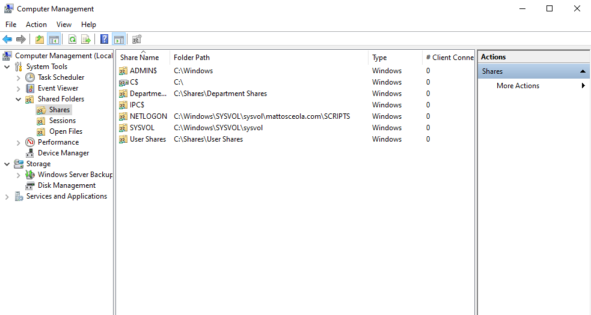
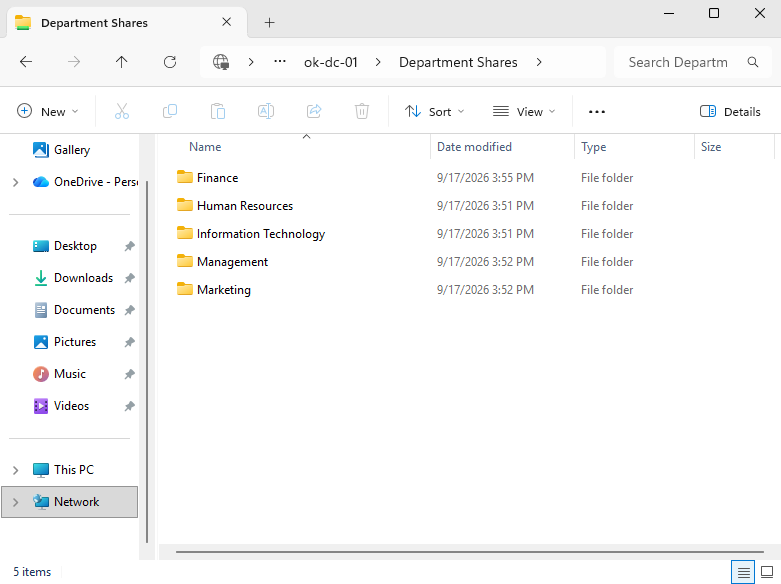

# File Shares Configuration & Validation

## Overview

Configured and validated **Windows Server 2022 file shares** to provide centralized access to department and user-specific folders within an Active Directory environment.

The shares were configured with appropriate **SMB share permissions** and tested using domain user accounts.

## Environment

* **Hypervisor:** Oracle VirtualBox
* **Server:** Windows Server 2022
* **Client:** Windows 11 Pro
* **Domain:** `mattosceola.com`
* **File Server:** `OK-DC-01`

## File Shares

### Department Shares

Created shared folders for department-level access:

- Information Technology
- Finance
- HR
- Marketing
- Management

Department shares provide centralized access to resources based on Active Directory group membership.

### User Shares

Created individual user shares to provide users with dedicated network storage.

User shares were configured to restrict access to the appropriate user account.

## Configuration

- Created shared folders on the Windows Server file server.
- Configured SMB file sharing for department and user folders.
- Applied share permissions based on the intended access level.
- Configured NTFS permissions separately to control file-system access.
- Used Active Directory security groups to manage department access.

## Validation

- Verified department shares were accessible from the Windows 11 client.
- Confirmed users could access shares according to their assigned permissions.
- Tested access using domain user accounts.
- Verified restricted folders could not be accessed by unauthorized users.

### Department Shares

### User Shares

### Shared Folders

### File Explorer Access

