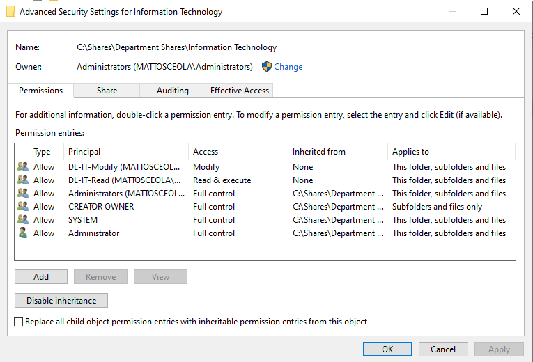
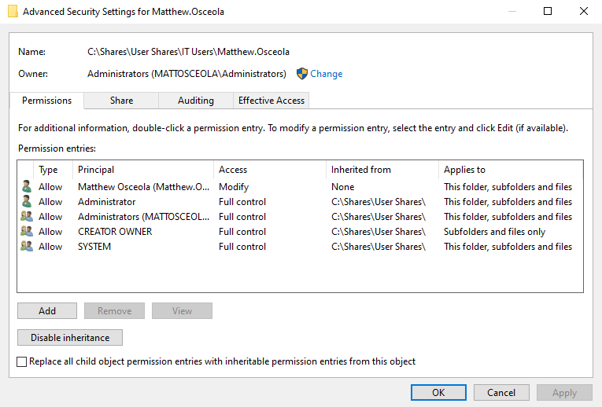
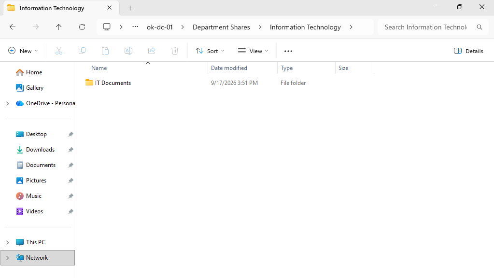
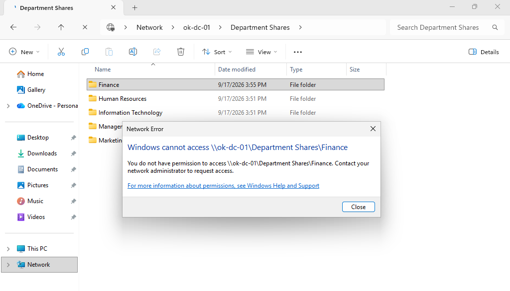
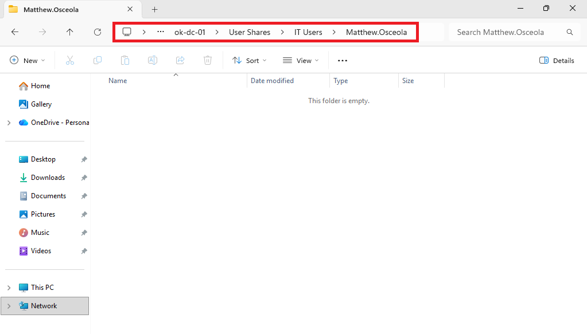

# NTFS Permissions Configuration & Validation

## Overview

Configured and validated **NTFS permissions** in a Windows Server 2022 Active Directory environment to control access to department and personal folders.

Department access was managed through **AGDLP (Accounts → Global Groups → Domain Local Groups → Permissions)**, allowing permissions to be assigned through Active Directory security groups instead of individual users.

## Environment

* **Hypervisor:** Oracle VirtualBox
* **Server:** Windows Server 2022
* **Domain Controller:** `OK-DC-01`
* **Client:** Windows 11 Pro
* **Domain:** `mattosceola.com`

## Configuration

### Department Folder Permissions

Configured department folders to grant access through **Domain Local security groups** rather than individual user accounts.

Examples include:

* `DL-Finance-Modify`
* `DL-Finance-Read`
* `DL-Human-Resources-Modify`
* `DL-Human-Resources-Read`
* `DL-Information-Technology-Modify`
* `DL-Information-Technology-Read`
* `DL-Marketing-Modify`
* `DL-Marketing-Read`
* `DL-Management-Modify`
* `DL-Management-Read`

Configured appropriate Read and Modify permissions for each department folder.

### Personal Folder Permissions

Configured personal user folders to restrict access to the assigned user while retaining administrator access for management.

Each personal folder was tested to verify that the assigned user could access the folder while other users were denied access.

### AGDLP Implementation

Applied the AGDLP permission model to department resources:

* Users assigned to **Global Groups**
* Global Groups assigned to **Domain Local Groups**
* Domain Local Groups assigned to **NTFS permissions**

This approach separates user membership from resource permissions and allows access changes to be managed through group membership.

## Validation

Verified the NTFS permission configuration by:

* Confirming department groups were assigned to the appropriate folders.
* Testing access with users from different departments.
* Verifying authorized users could access permitted folders.
* Confirming unauthorized users were denied access.
* Verifying personal folders were accessible only to their assigned users.
* Confirming administrators retained management access.

### Department Folder Security

*NTFS Security settings showing the configured permissions for a department folder.*

### Personal Folder Security

*NTFS Security settings showing the configured permissions for a personal user folder.*

### IT User Access

*Windows 11 client accessing a department folder with the user's assigned permissions.*

### Unauthorized Access Test

*Access attempt showing that a user without the required permissions was denied access to the folder.*

### Personal Folder Access

Windows 11 client accessing the user's assigned personal folder.

