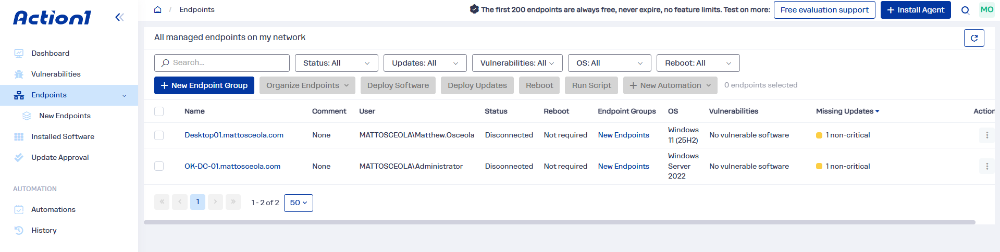
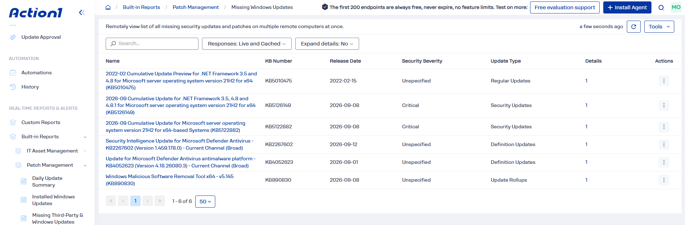
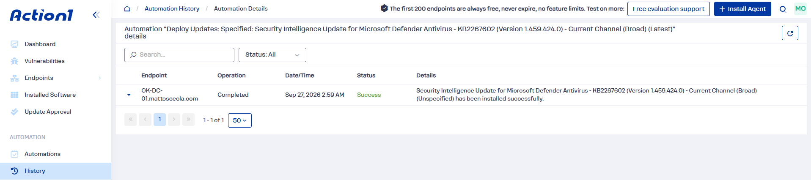
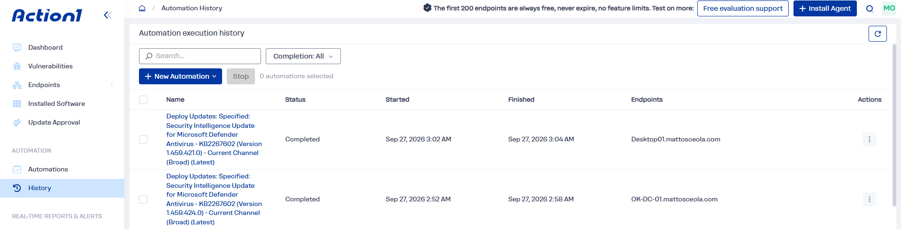

# Patch Management Configuration & Validation

## Overview

Configured and validated endpoint patch management using **Action1** to identify, deploy, and verify Windows updates across a Windows Server 2022 domain controller and Windows 11 Pro client.

The project demonstrates basic endpoint management, remote update deployment, and patch verification in a simulated IT support environment.

## Environment

* **Hypervisor:** Oracle VirtualBox
* **Server:** Windows Server 2022
* **Client:** Windows 11 Pro
* **Domain Controller:** `OK-DC-01`
* **Patch Management:** Action1

## Configuration

### Action1 Agent

Installed and configured the **Action1 agent** on the Windows Server 2022 and Windows 11 Pro systems to enable centralized endpoint management and remote patch deployment.

### Windows Update Deployment

Used Action1 to identify available Windows updates and deploy selected patches to the managed endpoints.

### Patch Verification

Verified that the selected updates were successfully installed and confirmed the updated patch status of both systems in Action1.

## Validation

* Confirmed the Windows Server 2022 and Windows 11 Pro systems were registered in Action1.
* Identified available Windows updates through Action1.
* Deployed selected Windows patches remotely.
* Verified successful patch installation.
* Confirmed both endpoints reported updated patch status.

### Endpoint Registration

*Action1 console showing the Windows Server 2022 and Windows 11 Pro endpoints registered for centralized management.*

### Available Updates

*Action1 displaying available Windows updates identified on the managed endpoints.*

### Patch Deployment

*Action1 showing the selected Windows updates being deployed to the managed endpoints.*

### Patch Verification

*Action1 showing the updated patch status after the selected updates were successfully installed.*

