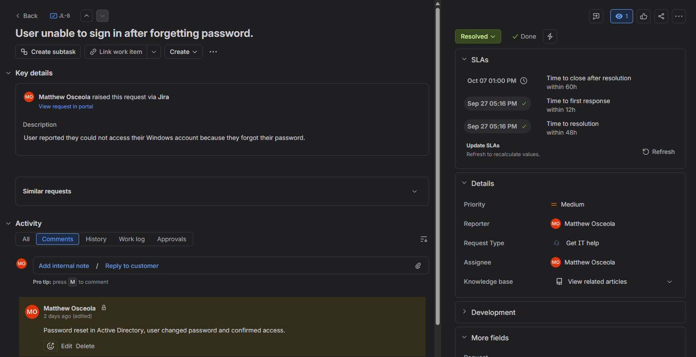
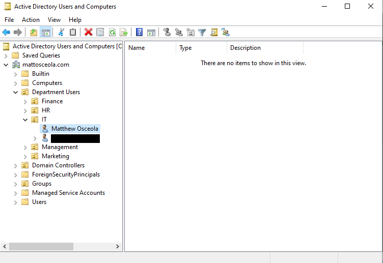
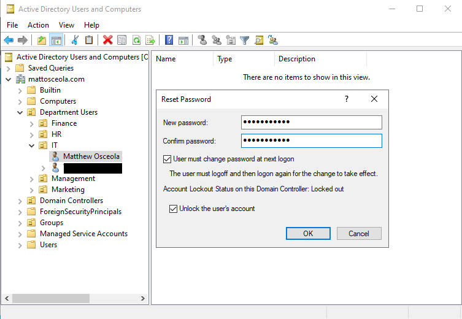
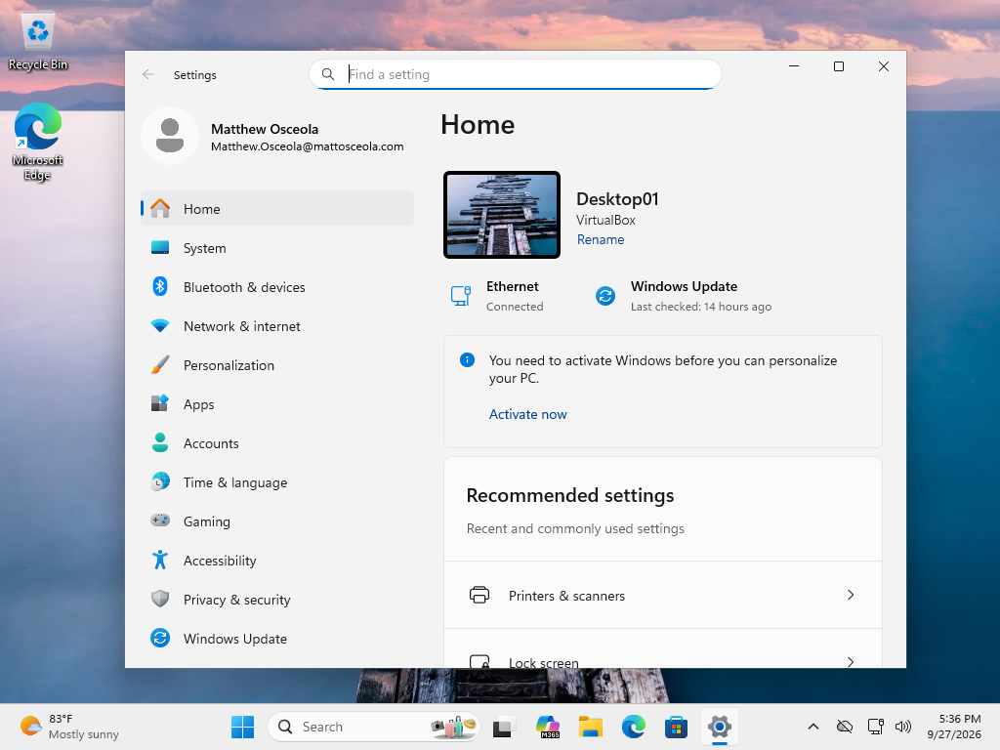

# Ticket 01 – Password Reset

## Overview

Resolved a simulated **Tier 1 password reset** request in a Windows Server 2022 Active Directory environment.

The request was documented and tracked in **Jira Service Management**. The user's password was reset through **Active Directory Users and Computers (ADUC)**, and the resolution was validated from a Windows 11 client.

## Environment

| Component               | Details                                     |
| ----------------------- | ------------------------------------------- |
| **Server**              | Windows Server 2022                         |
| **Client**              | Windows 11 Pro                              |
| **Domain**              | `mattosceola.com`                           |
| **Server Name**         | `OK-DC-01`                                  |
| **Ticketing System**    | Jira Service Management                     |
| **Administrative Tool** | Active Directory Users and Computers (ADUC) |

## Ticket Summary

| Field            | Value                                                   |
| ---------------- | ------------------------------------------------------- |
| **Jira Issue**   | JL-8                                                    |
| **Request Type** | General IT Help                                         |
| **Issue Type**   | Service Request                                         |
| **Priority**     | Medium                                                  |
| **Status**       | Done                                                    |
| **Issue**        | User unable to sign in after forgetting their password. |

## Jira Workflow

1. Created the request in Jira Service Management.
2. Documented the user's password reset request.
3. Moved the ticket to **In Progress** while troubleshooting.
4. Reset the user's password in Active Directory.
5. Verified the user could successfully sign in.
6. Documented the resolution and moved the ticket to **Done**.

## Resolution

1. Opened **Active Directory Users and Computers**.
2. Located the affected user account.
3. Selected **Reset Password**.
4. Assigned a temporary password.
5. Enabled **User must change password at next logon**.
6. Confirmed the password reset completed successfully.

## Validation

* Verified the password reset completed without errors.
* Signed in to the Windows 11 client using the temporary password.
* Confirmed Windows prompted the user to change the temporary password.
* Verified the user successfully accessed their account after changing the password.
* Updated the Jira ticket with the resolution and closed the request.

### Jira Ticket Overview

*Created and tracked the password reset request in Jira, including the issue key, request type, priority, status, and issue summary.*

### Active Directory User Account

*Located the affected user account in Active Directory Users and Computers.*

### Password Reset

*Reset the user's password and required a password change at the next sign-in.*

### Successful Client Sign-In

*Verified the user successfully signed in after changing the temporary password.*

