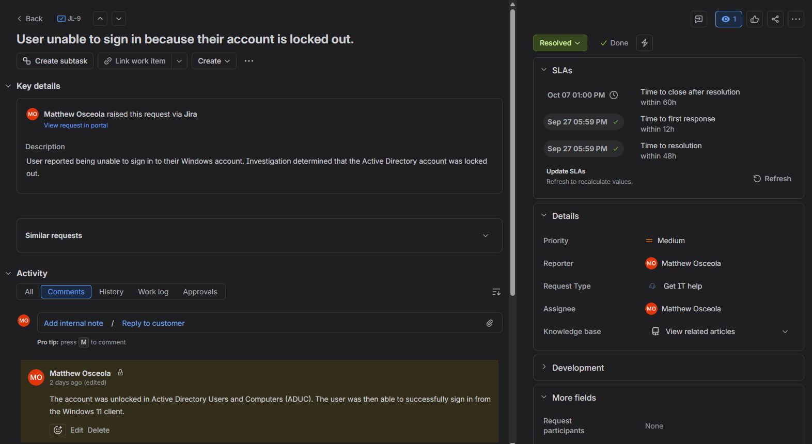
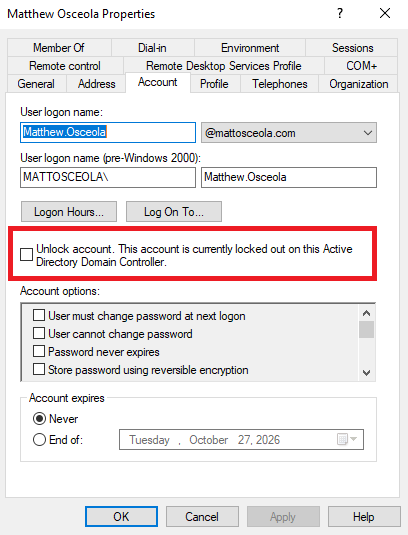
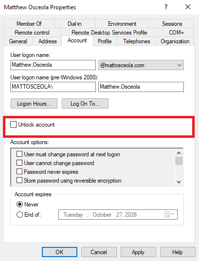
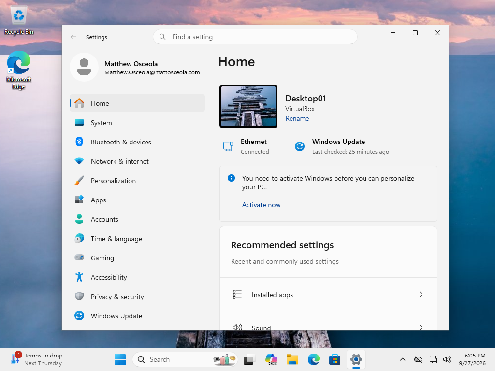

# Ticket 02 – Account Lockout

## Overview

Resolved a simulated **Tier 1 account lockout** request in a Windows Server 2022 Active Directory environment.

The request was documented and tracked in **Jira Service Management**. The user's account was located and unlocked through **Active Directory Users and Computers (ADUC)**, and successful sign-in was verified from a Windows 11 client.

## Environment

| Component               | Details                                     |
| ----------------------- | ------------------------------------------- |
| **Server**              | Windows Server 2022                         |
| **Client**              | Windows 11 Pro                              |
| **Domain**              | `mattosceola.com`                           |
| **Server Name**         | `OK-DC-01`                                  |
| **Ticketing System**    | Jira Service Management                     |
| **Administrative Tool** | Active Directory Users and Computers (ADUC) |

## Ticket Summary

| Field            | Value                                                        |
| ---------------- | ------------------------------------------------------------ |
| **Jira Issue**   | JL-9                                                         |
| **Request Type** | General IT Help                                              |
| **Issue Type**   | Service Request                                              |
| **Priority**     | Medium                                                       |
| **Status**       | Done                                                         |
| **Issue**        | User unable to sign in because their account was locked out. |

## Jira Workflow

1. Created the request in Jira Service Management.
2. Documented the user's account lockout issue.
3. Moved the ticket to **In Progress** while investigating the issue.
4. Located the affected account in Active Directory.
5. Unlocked the user account.
6. Verified the user could successfully sign in.
7. Documented the resolution and moved the ticket to **Done**.

## Troubleshooting

1. Opened **Active Directory Users and Computers**.
2. Located the affected user account.
3. Opened the user's account properties.
4. Confirmed the account was locked.
5. Unlocked the account.
6. Confirmed the account was available for sign-in.

## Resolution

The user's Active Directory account was unlocked and the user was able to sign in successfully from the Windows 11 client.

## Validation

* Verified the account lockout status in Active Directory.
* Unlocked the affected user account.
* Attempted to sign in from the Windows 11 client.
* Confirmed the user successfully accessed their Windows account.
* Updated the Jira ticket with the resolution.
* Moved the Jira ticket to **Done**.

### Jira Ticket Overview

*Created and tracked the account lockout request in Jira, including the issue key, request type, priority, status, and issue summary.*

### Locked User Account

*Verified the affected user account was locked in Active Directory Users and Computers.*

### Account Unlock

*Unlocked the affected user account through Active Directory Users and Computers.*

### Successful Client Sign-In

*Verified the user successfully signed in after the account was unlocked.*

