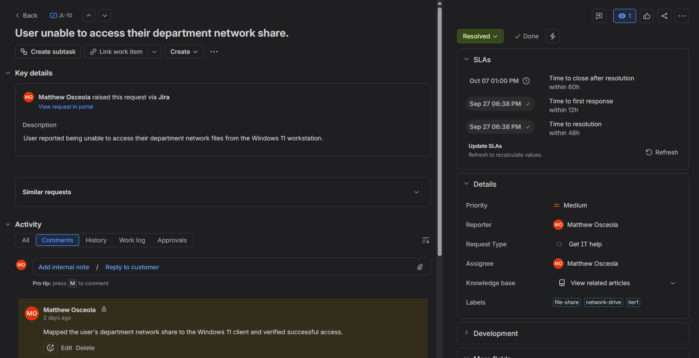
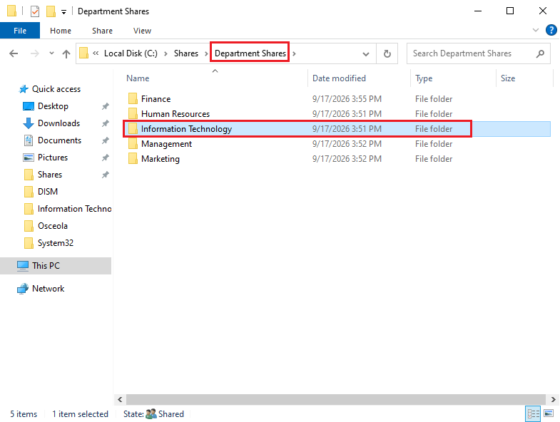
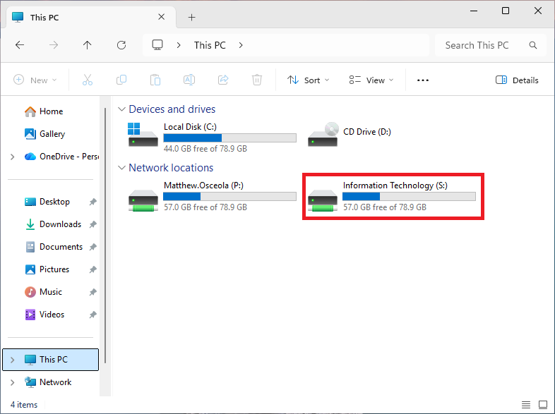
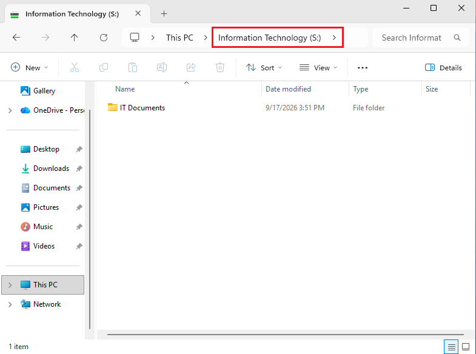

# Ticket 03 – Map Network Drive

## Overview

Resolved a simulated **Tier 1 mapped network drive** request in a Windows Server 2022 Active Directory environment.

The request was documented and tracked in **Jira Service Management**. The user's department network share was mapped to the Windows 11 client and access was verified using the user's domain account.

## Environment

| Component                | Details                                             |
| ------------------------ | --------------------------------------------------- |
| **Server**               | Windows Server 2022                                 |
| **Client**               | Windows 11 Pro                                      |
| **Domain**               | `mattosceola.com`                                   |
| **Server Name**          | `OK-DC-01`                                          |
| **Ticketing System**     | Jira Service Management                             |
| **File Server**          | Windows Server 2022                                 |
| **Administrative Tools** | File Explorer, Active Directory Users and Computers |

## Ticket Summary

| Field            | Value                                                 |
| ---------------- | ----------------------------------------------------- |
| **Jira Issue**   | JL-10                                                 |
| **Request Type** | General IT Help                                       |
| **Issue Type**   | Service Request                                       |
| **Priority**     | Medium                                                |
| **Status**       | Done                                                  |
| **Issue**        | User unable to access their department network share. |

## Jira Workflow

1. Created the request in Jira Service Management.
2. Documented the user's network drive access issue.
3. Moved the ticket to **In Progress** while investigating.
4. Verified the user's access to the appropriate department share.
5. Mapped the network share on the Windows 11 client.
6. Verified the user could access the mapped drive.
7. Documented the resolution and moved the ticket to **Done**.

## Troubleshooting

1. Confirmed the user was signed in with their domain account.
2. Verified the appropriate department share was available on the file server.
3. Confirmed the user's permissions allowed access to the share.
4. Mapped the network share to the Windows 11 client.
5. Verified the mapped drive appeared in File Explorer.
6. Tested access to the mapped drive and confirmed the user could open the share.

## Resolution

The user's department network share was mapped to the Windows 11 client and access was successfully verified using the user's domain account.

## Validation

* Verified the mapped drive appeared in File Explorer.
* Confirmed the drive pointed to the appropriate department share.
* Opened the mapped drive successfully.
* Verified the user could access the appropriate files and folders.
* Updated the Jira ticket with the resolution.
* Moved the Jira ticket to **Done**.

### Jira Ticket Overview

*Created and tracked the network drive request in Jira, including the issue key, request type, priority, status, and issue summary.*

### Department Share

*Verified the user's department share was available on the Windows Server file server.*

### Mapped Network Drive

*Mapped the user's department share to the Windows 11 client and verified it appeared in File Explorer.*

### Network Drive Access

*Verified the user could successfully access the mapped department drive.*

