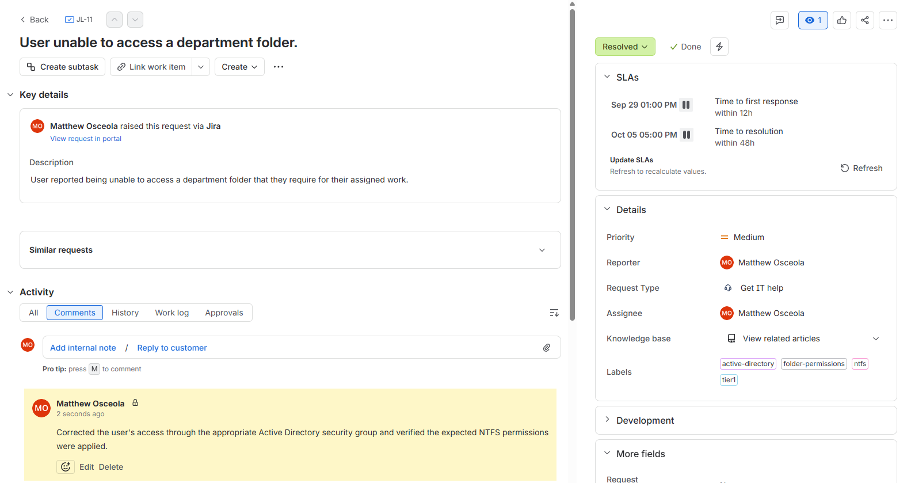
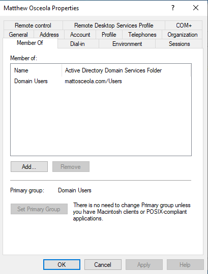
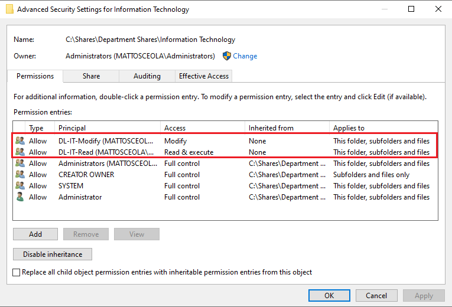
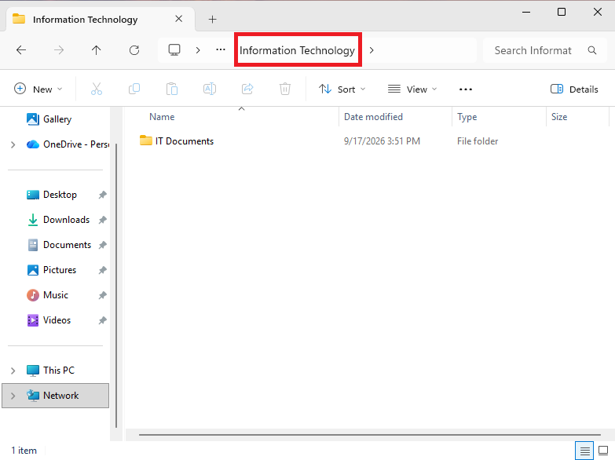

# Ticket 04 – Folder Permission Issue

## Overview

Resolved a simulated **Tier 1 folder permission** issue in a Windows Server 2022 Active Directory environment.

The request was documented and tracked in **Jira Service Management**. The user's access to a department folder was investigated, the appropriate permissions were verified, and successful access was validated from a Windows 11 client.

## Environment

| Component            | Details                                                            |
| -------------------- | ------------------------------------------------------------------ |
| Server               | Windows Server 2022                                                |
| Client               | Windows 11 Pro                                                     |
| Domain               | `mattosceola.com`                                                  |
| Server Name          | `OK-DC-01`                                                         |
| Ticketing System     | Jira Service Management                                            |
| Administrative Tools | Active Directory Users and Computers, File Explorer, NTFS Security |

## Ticket Summary

| Field            | Value                                      |
| ---------------- | ------------------------------------------ |
| **Jira Issue**   | JL-11                                      |
| **Request Type** | General IT Help                            |
| **Issue Type**   | Service Request                            |
| **Priority**     | Medium                                     |
| **Status**       | Done                                       |
| **Issue**        | User unable to access a department folder. |

## Jira Workflow

1. Created the request in Jira Service Management.
2. Documented the user's folder access issue.
3. Moved the ticket to **In Progress** while investigating.
4. Verified the user's Active Directory group membership.
5. Reviewed the folder's NTFS permissions.
6. Corrected the user's access through the appropriate security group.
7. Verified the user could successfully access the folder.
8. Documented the resolution and moved the ticket to **Done**.

## Troubleshooting

1. Confirmed the user was signed in with their domain account.
2. Reproduced the reported folder access issue.
3. Checked the user's Active Directory group membership.
4. Reviewed the folder's NTFS permissions.
5. Identified the missing or incorrect permission assignment.
6. Corrected access through the appropriate Active Directory security group.
7. Re-tested access from the Windows 11 client.

## Resolution

Corrected the user's folder access by updating the appropriate Active Directory security group membership and verifying the resulting NTFS permissions.

## Validation

* Verified the user's membership in the appropriate security group.
* Confirmed the expected NTFS permissions were applied.
* Accessed the affected folder from the Windows 11 client.
* Verified the user could successfully access the folder.
* Updated the Jira ticket with the resolution.
* Moved the Jira ticket to **Done**.

### Jira Ticket Overview

*Created and tracked the folder permission request in Jira, including the issue key, request type, priority, status, and issue summary.*

### User Group Membership

*Verified the user's membership in the Active Directory security group responsible for folder access.*

### NTFS Permissions

*Verified the appropriate security group had the required NTFS permissions on the affected folder.*

### Successful Folder Access

*Verified the user could successfully access the folder after the permission issue was resolved.*

