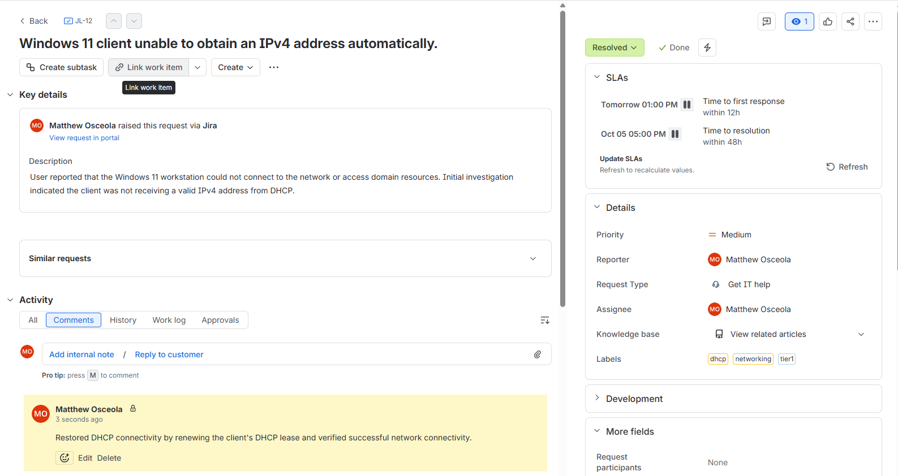
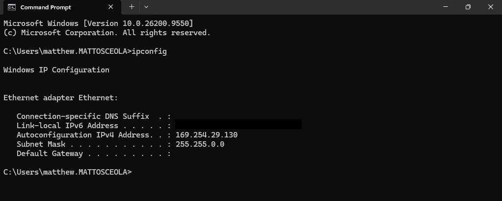
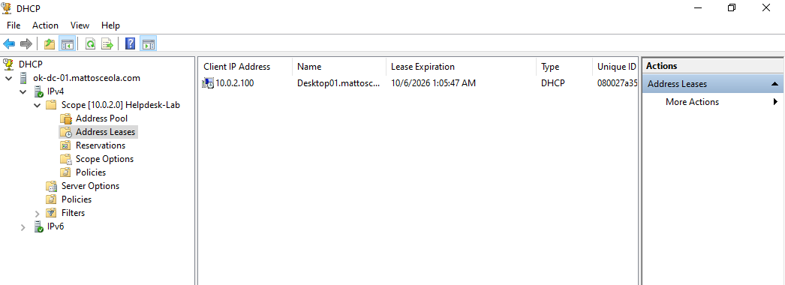
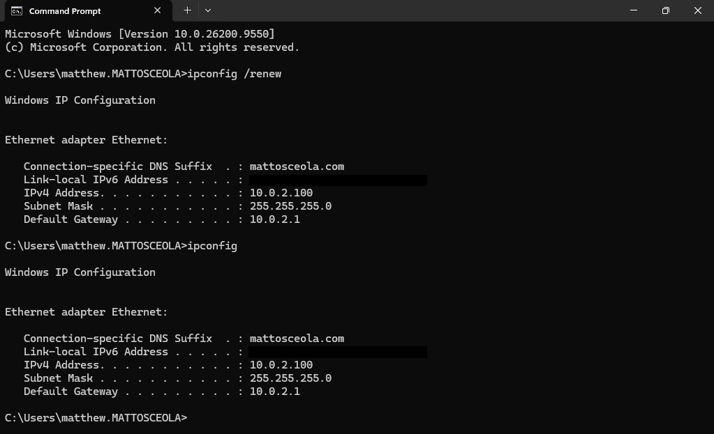
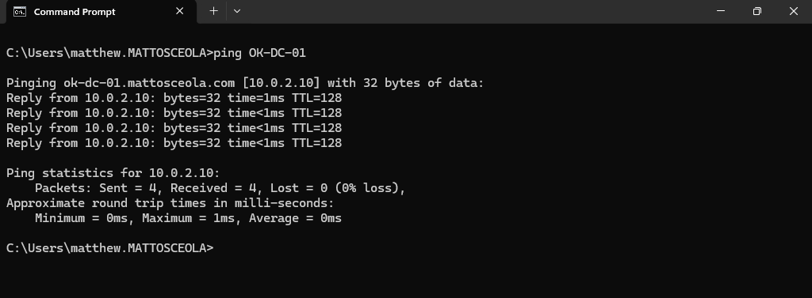

# Ticket 05 – DHCP No IP Address

## Overview

Resolved a simulated **Tier 1 DHCP connectivity** issue in a Windows Server 2022 Active Directory environment.

The request was documented and tracked in **Jira Service Management**. The Windows 11 client was unable to obtain an IPv4 address automatically, and connectivity was restored by troubleshooting the DHCP configuration and renewing the client's DHCP lease.

## Environment

| Component                | Details                                        |
|------------------------- | -----------------------------------------------|
| **Server**               | Windows Server 2022                            |
| **Client**               | Windows 11 Pro                                 |
| **Domain**               | `mattosceola.com`                              |
| **Server Name**          | `OK-DC-01`                                     |
| **DHCP Server**          | `10.0.2.10`                                    |
| **Scope**                | `10.0.2.100–10.0.2.200`                        |
| **Subnet**               | `10.0.2.0/24`                                  |
| **Gateway**              | `10.0.2.1`                                     |
| **Ticketing System**     | Jira Service Management                        |
| **Administrative Tools** | DHCP Manager, Command Prompt, Network Settings |

## Ticket Summary

| Field            | Value                                                  |
|----------------- | -------------------------------------------------------|
| **Jira Issue**   | JL-12                                                  |
| **Request Type** | General IT Help                                        |
| **Issue Type**   | Service Request                                        |
| **Priority**     | High                                                   |
| **Status**       | Done                                                   |
| **Issue**        | Client unable to obtain an IPv4 address automatically. |

## Jira Workflow

1. Created the request in Jira Service Management.
2. Documented the client's network connectivity issue.
3. Moved the ticket to **In Progress** while investigating.
4. Verified the client's network adapter configuration.
5. Checked the DHCP server and scope configuration.
6. Renewed the client's DHCP lease.
7. Verified the client received a valid IPv4 address.
8. Documented the resolution and moved the ticket to **Done**.

## Troubleshooting

1. Confirmed the client could not obtain a valid IPv4 address.
2. Verified the network adapter was configured for automatic IP assignment.
3. Reviewed the DHCP scope in DHCP Manager.
4. Confirmed the DHCP service was available.
5. Renewed the client's DHCP lease.
6. Verified the client received a valid lease from the DHCP server.
7. Tested network connectivity after the lease was assigned.

## Resolution

Restored DHCP connectivity by renewing the client's DHCP lease and confirming the client received a valid IPv4 address from the Windows Server 2022 DHCP server.

## Validation

- Verified the client received an IPv4 address within the DHCP scope.
- Confirmed the default gateway and DNS server were assigned correctly.
- Successfully renewed the DHCP lease.
- Verified connectivity between the client and the domain controller.
- Updated the Jira ticket with the resolution.
- Moved the Jira ticket to **Done**.

### Jira Ticket Overview

*Created and tracked the DHCP connectivity request in Jira, including the issue key, request type, priority, status, and issue summary.*

### No IP Address

*Verified the client was unable to obtain a valid IPv4 address before troubleshooting.*

### DHCP Scope

*Reviewed the DHCP scope configuration on the Windows Server DHCP service.*

### Successful DHCP Lease

*Verified the client received a valid DHCP lease after troubleshooting.*

### Network Connectivity

*Confirmed successful network connectivity after DHCP service was restored.*

