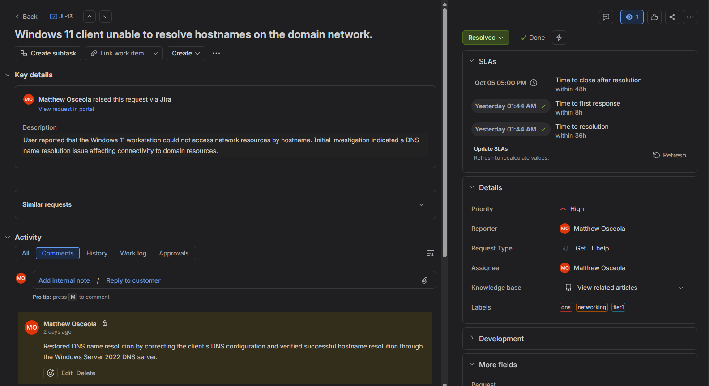
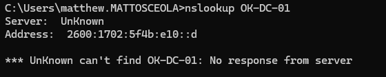
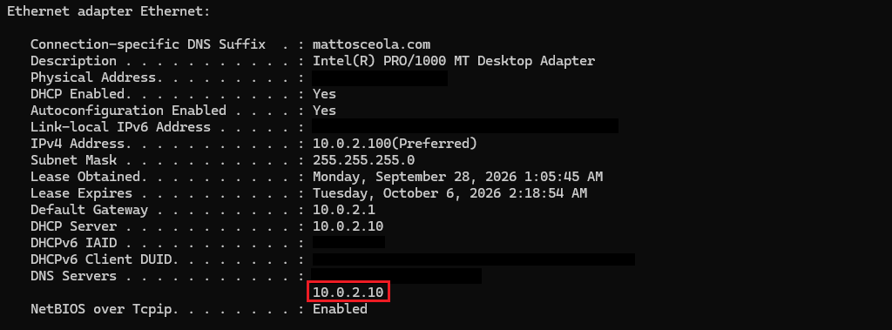
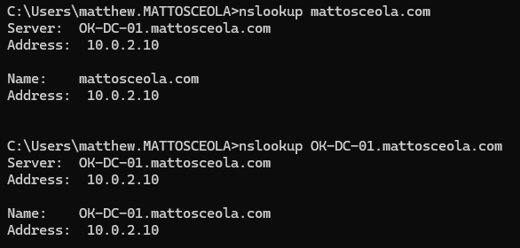
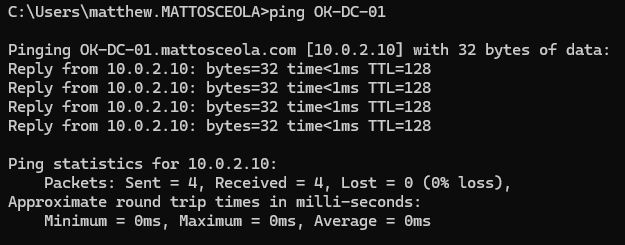

# Ticket 06 – DNS Name Resolution

## Overview

Resolved a simulated **Tier 1 DNS name resolution** issue in a Windows Server 2022 Active Directory environment.

The request was documented and tracked in **Jira Service Management**. The Windows 11 client was unable to resolve the domain controller by hostname, and connectivity was restored by verifying the DNS configuration and confirming successful name resolution.

## Environment

| Component            | Details                                               |
|--------------------- | ------------------------------------------------------|
| Server               | Windows Server 2022                                   |
| Client               | Windows 11 Pro                                        |
| Domain               | `mattosceola.com`                                     |
| Server Name          | `OK-DC-01`                                            |
| DNS Server           | `10.0.2.10`                                           |
| Gateway              | `10.0.2.1`                                            |
| Ticketing System     | Jira Service Management                               |
| Administrative Tools | DNS Manager, Command Prompt, Network Adapter Settings |

## Ticket Summary

| Field               | Value                                                     |
|-------------------- | ----------------------------------------------------------|
| **Jira Issue**      | JL-13                                                     |
| **Request Type**    | General IT Help                                           |
| **Issue Type**      | Service Request                                           |
| **Priority**        | High                                                      |
| **Status**          | Done                                                      |
| **Issue**           | Client unable to resolve hostnames on the domain network. |

## Jira Workflow

1. Created the request in Jira Service Management.
2. Documented the reported name resolution issue.
3. Moved the ticket to **In Progress** while investigating.
4. Verified the client's DNS server configuration.
5. Tested name resolution using Command Prompt.
6. Confirmed the DNS server responded correctly.
7. Verified successful hostname resolution.
8. Documented the resolution and moved the ticket to **Done**.

## Troubleshooting

1. Confirmed the client could not resolve hostnames.
2. Verified the client's DNS server settings.
3. Tested name resolution using `nslookup`.
4. Confirmed the DNS server was reachable.
5. Verified the required DNS records were available.
6. Re-tested name resolution after correcting the configuration.
7. Confirmed the client could successfully resolve the domain controller.

## Resolution

Restored DNS name resolution by correcting the client's DNS configuration and verifying successful hostname resolution through the Windows Server 2022 DNS server.

## Validation

- Verified the client used `10.0.2.10` as its DNS server.
- Confirmed `nslookup` successfully resolved `mattosceola.com`.
- Confirmed `nslookup` successfully resolved `OK-DC-01.mattosceola.com`.
- Verified the client could communicate with the domain controller after name resolution was restored.
- Updated the Jira ticket with the resolution.
- Moved the Jira ticket to **Done**.

### Jira Ticket Overview

*Created and tracked the DNS name resolution request in Jira, including the issue key, request type, priority, status, and issue summary.*

### DNS Resolution Failure

*Verified the client was unable to resolve hostnames before troubleshooting.*

### DNS Configuration

*Verified the client's DNS server configuration and the Windows Server DNS service.*

### Successful Name Resolution

*Verified the client successfully resolved the domain and domain controller after troubleshooting.*

### Network Connectivity

*Confirmed successful communication with the domain controller after DNS resolution was restored.*

