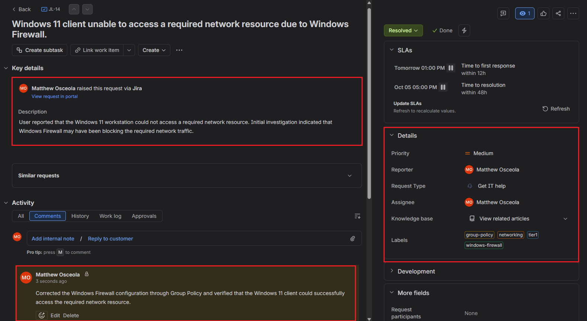
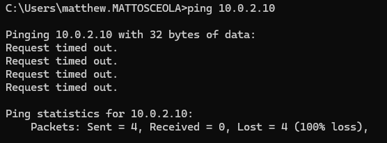
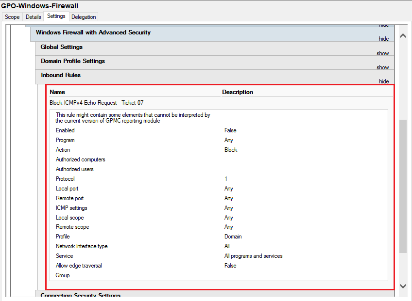
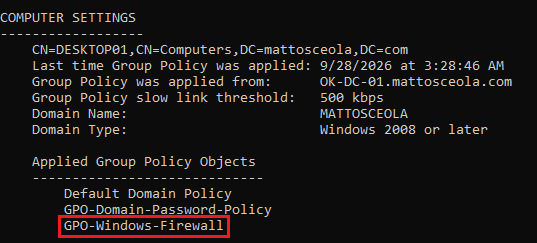
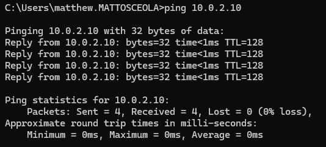

# Ticket 07 – Windows Firewall Access

## Overview

Resolved a simulated **Tier 1 Windows Firewall access** issue in a Windows Server 2022 Active Directory environment.

The request was documented and tracked in **Jira Service Management**. The Windows 11 client was unable to access a required network resource, and connectivity was restored by reviewing the Windows Firewall configuration and verifying the appropriate firewall rule.

## Environment

| Component            | Details                                                                        |
| -------------------- | ------------------------------------------------------------------------------ |
| Server               | Windows Server 2022                                                            |
| Client               | Windows 11 Pro                                                                 |
| Domain               | `mattosceola.com`                                                              |
| Server Name          | `OK-DC-01`                                                                     |
| Firewall             | Windows Defender Firewall                                                      |
| Gateway              | `10.0.2.1`                                                                     |
| Ticketing System     | Jira Service Management                                                        |
| Administrative Tools | Windows Defender Firewall with Advanced Security, Group Policy, Command Prompt |

## Ticket Summary

| Field            | Value                                                                                         |
| ---------------- | --------------------------------------------------------------------------------------------- |
| **Jira Issue**   | JL-14                                                                                         |
| **Request Type** | General IT Help                                                                               |
| **Issue Type**   | Service Request                                                                               |
| **Priority**     | Medium                                                                                        |
| **Status**       | Done                                                                                          |
| **Issue**        | Client unable to access a required network resource due to Windows Firewall blocking traffic. |

## Jira Workflow

1. Created the request in Jira Service Management.
2. Documented the reported network access issue.
3. Moved the ticket to **In Progress** while investigating.
4. Reproduced the access issue from the Windows 11 client.
5. Reviewed the Windows Firewall configuration.
6. Identified the firewall rule affecting the required traffic.
7. Corrected the firewall configuration.
8. Verified successful network access.
9. Documented the resolution and moved the ticket to **Done**.

## Troubleshooting

1. Confirmed the client could not access the required network resource.
2. Verified the client had network connectivity to the domain controller.
3. Reviewed the Windows Defender Firewall configuration.
4. Identified the firewall rule affecting the required traffic.
5. Verified the firewall rule configuration and profile.
6. Corrected the firewall configuration through the appropriate security policy.
7. Re-tested access from the Windows 11 client.
8. Confirmed the client could successfully access the network resource.

## Resolution

Restored network resource access by correcting the Windows Firewall configuration and verifying that the appropriate firewall rule allowed the required traffic.

## Validation

* Verified the appropriate Windows Firewall rule was configured correctly.
* Confirmed the firewall policy was applied to the Windows 11 client.
* Verified the client could successfully access the required network resource.
* Confirmed network connectivity after the firewall configuration was corrected.
* Updated the Jira ticket with the resolution.
* Moved the Jira ticket to **Done**.

### Jira Ticket Overview

*Created and tracked the Windows Firewall access request in Jira, including the issue key, request type, priority, status, and issue summary.*

### Firewall Access Failure

*Verified the client was unable to access the required network resource before troubleshooting.*

### Firewall Rule Configuration

*Reviewed the Windows Firewall rule affecting the required network traffic.*

### Applied Firewall Policy

*Verified the corrected firewall configuration was applied to the Windows 11 client.*

### Successful Network Access

*Confirmed the client could successfully access the network resource after the firewall configuration was corrected.*

