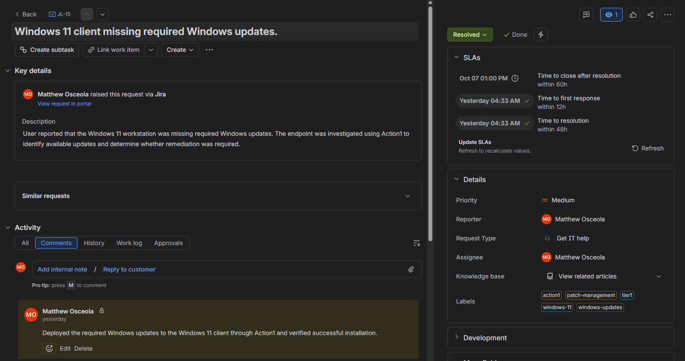
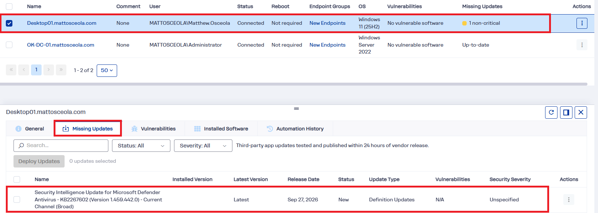
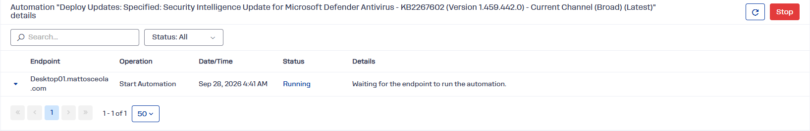
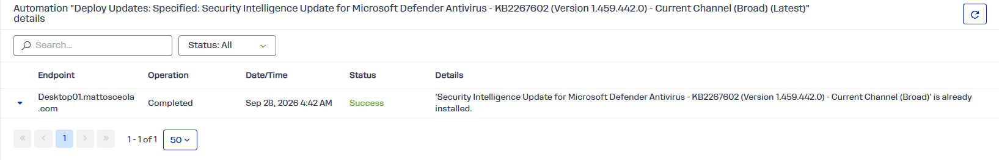
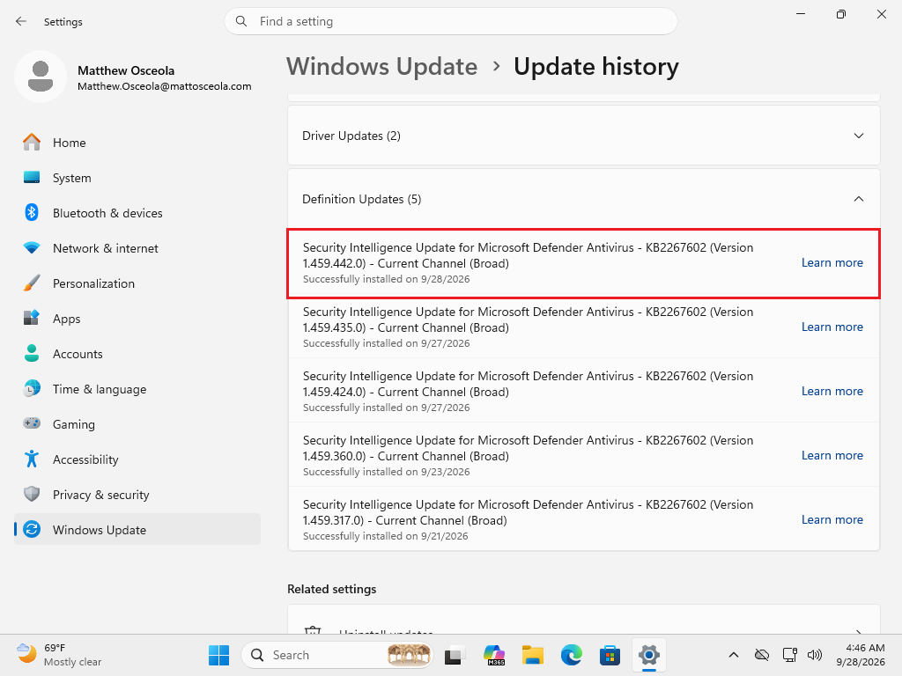

# Ticket 08 – Windows Updates / Action1

## Overview

Resolved a simulated **Tier 1 Windows Update** issue in a Windows Server 2022 Active Directory environment using **Action1** for patch management.

The request was documented and tracked in **Jira Service Management**. The Windows 11 client was missing Windows updates, and the updates were identified and deployed through Action1.

## Environment

| Component                | Details                                 |
| ------------------------ | --------------------------------------- |
| **Server**               | Windows Server 2022                     |
| **Client**               | Windows 11 Pro                          |
| **Domain**               | `mattosceola.com`                       |
| **Server Name**          | `OK-DC-01`                              |
| **Patch Management**     | Action1                                 |
| **Ticketing System**     | Jira Service Management                 |
| **Administrative Tools** | Action1, Windows Update, Command Prompt |

## Ticket Summary

| Field            | Value                                               |
| ---------------- | --------------------------------------------------- |
| **Jira Issue**   | JL-15                                               |
| **Request Type** | General IT Help                                     |
| **Issue Type**   | Service Request                                     |
| **Priority**     | Medium                                              |
| **Status**       | Done                                                |
| **Issue**        | Windows 11 client missing required Windows updates. |

## Jira Workflow

1. Created the request in Jira Service Management.
2. Documented the reported Windows Update issue.
3. Moved the ticket to **In Progress** while investigating.
4. Verified the Windows 11 client was missing updates.
5. Reviewed the endpoint in Action1.
6. Identified the available Windows updates.
7. Deployed the required updates through Action1.
8. Verified the update deployment completed successfully.
9. Confirmed the Windows 11 client was up to date.
10. Documented the resolution and moved the Jira ticket to **Done**.

## Troubleshooting

1. Confirmed the Windows 11 client was missing available updates.
2. Verified the client was registered as an endpoint in Action1.
3. Reviewed the endpoint's missing updates.
4. Identified the applicable Windows updates.
5. Initiated the update deployment through Action1.
6. Monitored the deployment status.
7. Rebooted the client if required by the updates.
8. Rechecked the endpoint after deployment.
9. Confirmed the required updates were successfully installed.

## Resolution

Deployed the required Windows updates to the Windows 11 client through **Action1** and verified that the endpoint was successfully updated.

## Validation

* Verified the Windows 11 endpoint was managed by Action1.
* Confirmed the required Windows updates were identified.
* Verified the updates were successfully deployed through Action1.
* Confirmed the Windows 11 client completed any required reboot.
* Verified the endpoint no longer showed the deployed updates as missing.
* Confirmed the Windows client was up to date after remediation.
* Updated the Jira ticket with the resolution.
* Moved the Jira ticket to **Done**.

### Jira Ticket Overview

*Created and tracked the Windows Update request in Jira, including the issue key, request type, priority, status, and issue summary.*

### Missing Windows Updates

*Verified the Windows 11 endpoint had available Windows updates requiring deployment.*

### Action1 Update Deployment

*Deployed the required Windows updates to the Windows 11 endpoint through Action1.*

### Update Deployment Success

*Verified that the Windows updates were successfully deployed to the Windows 11 endpoint.*

### Successful Update Validation

*Confirmed the Windows 11 endpoint was updated successfully and no longer showed the deployed updates as missing.*

