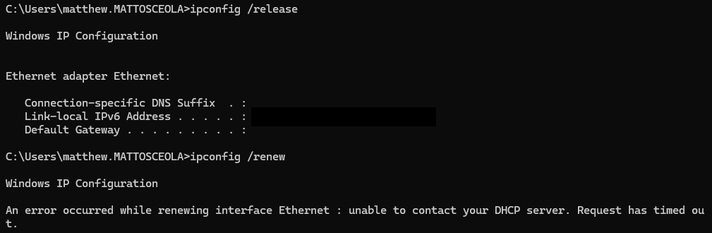

# DHCP Troubleshooting

## Overview

Troubleshot a DHCP client connectivity issue in a Windows Server 2022 Active Directory environment after the Windows 11 client failed to receive the expected network configuration.

The issue was resolved by verifying the DHCP server configuration, renewing the client lease, and confirming the client received the correct IP address, gateway, and DNS server.

## Environment

- Windows Server 2022 (OK-DC-01)
- Windows 11 Pro (Desktop01)
- Domain: mattosceola.com
- Oracle VirtualBox NAT Network
- DHCP Server: 10.0.2.10
- Scope: 10.0.2.0/24
- Address Pool: 10.0.2.100–10.0.2.200

## Symptoms

- Windows 11 client did not receive the expected DHCP configuration.
- Network connectivity required verification after renewing the DHCP lease.
- Client IP assignment needed to be validated before testing domain connectivity.

## Investigation

Verified the DHCP configuration on both the client and server before renewing the lease.

### Client Checks

- Confirmed the network adapter was set to obtain an IP address automatically.
- Used `ipconfig /all` to review the assigned IPv4 address, gateway, and DNS server.
- Used `ipconfig /release` followed by `ipconfig /renew` to request a new DHCP lease.

### Server Checks

- Verified the DHCP scope was active.
- Confirmed the address pool was configured for `10.0.2.100–10.0.2.200`.
- Verified the DHCP server was authorized and serving the VirtualBox NAT Network.

## Resolution

Resolved the issue by renewing the client DHCP lease after confirming the DHCP scope and network configuration were correct.

The client successfully obtained:

- IPv4 address within the configured DHCP scope
- Default gateway: `10.0.2.1`
- DNS server: `10.0.2.10`

## Validation

Verified the DHCP configuration was working correctly by confirming:

- `ipconfig /all` displayed an address within the configured scope.
- The default gateway was `10.0.2.1`.
- The DNS server was `10.0.2.10`.
- The client maintained network connectivity after lease renewal.

### Initial Issue

*Client network configuration before troubleshooting.*

### Investigation

*`ipconfig /all` and DHCP scope configuration.*

### Resolution

*Successful DHCP lease renewal.*

### Validation

*Verified the assigned IP address, gateway, and DNS server after the fix.*

