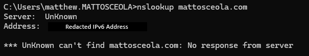
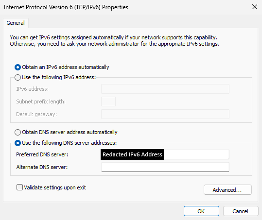
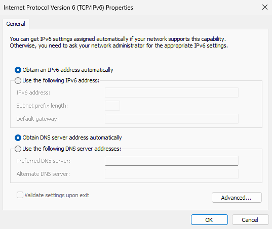
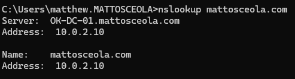

# DNS Troubleshooting

## Overview

Troubleshot a DNS name resolution issue in a Windows Server 2022 Active Directory environment after the Windows 11 client continued using an unintended IPv6 DNS server from a previous network configuration.

The issue was resolved by correcting the client DNS configuration and validating forward and reverse DNS resolution against the Windows Server DNS service.

## Environment

* **Hypervisor:** Oracle VirtualBox
* **Server:** Windows Server 2022 (OK-DC-01)
* **Client:** Windows 11 Pro (Desktop01)
* **Domain:** mattosceola.com
* **Network:** Oracle VirtualBox NAT Network
* **DNS Server:** 10.0.2.10

## Symptoms

* Windows 11 client continued to reference an IPv6 DNS server from the previous network configuration.
* DNS queries were not consistently using the Windows Server DNS service.
* DNS configuration needed to be verified before testing Active Directory name resolution.

## Investigation

Verified the DNS configuration on the Windows 11 client and tested name resolution against the Windows Server DNS service.

### Client Checks

* Used `ipconfig /all` to review the configured DNS servers.
* Identified a manually configured IPv6 DNS server left over from the previous network configuration.
* Reviewed the network adapter's IPv4 and IPv6 DNS settings.

### DNS Checks

* Used `nslookup mattosceola.com 10.0.2.10` to test forward DNS resolution.
* Used `nslookup 10.0.2.10 10.0.2.10` to test reverse DNS resolution.
* Verified the Windows Server DNS service was resolving the expected domain and host records.

## Resolution

Resolved the issue by changing the client IPv6 DNS configuration back to automatic and ensuring the Windows 11 client could use the Windows Server DNS service.

The client was then able to query the Windows Server DNS service at `10.0.2.10` for Active Directory DNS resolution.

## Validation

Verified DNS was working correctly by confirming:

* `ipconfig /all` no longer showed the previous manually configured IPv6 DNS server.
* `nslookup mattosceola.com 10.0.2.10` successfully resolved the domain to `10.0.2.10`.
* `nslookup 10.0.2.10 10.0.2.10` successfully resolved the server IP to `OK-DC-01.mattosceola.com`.
* The client successfully resolved DNS records using the Windows Server DNS service.

### Initial Issue

*The client was still configured with an IPv6 DNS server from the previous network configuration.*

### Investigation

*The client DNS configuration and DNS query results were reviewed to identify the unexpected DNS server.*

### Resolution

*The IPv6 DNS configuration was returned to automatic so the client could use the intended DNS configuration.*

### Validation

*The client DNS lookup successfully resolved through the Windows Server DNS service.*

