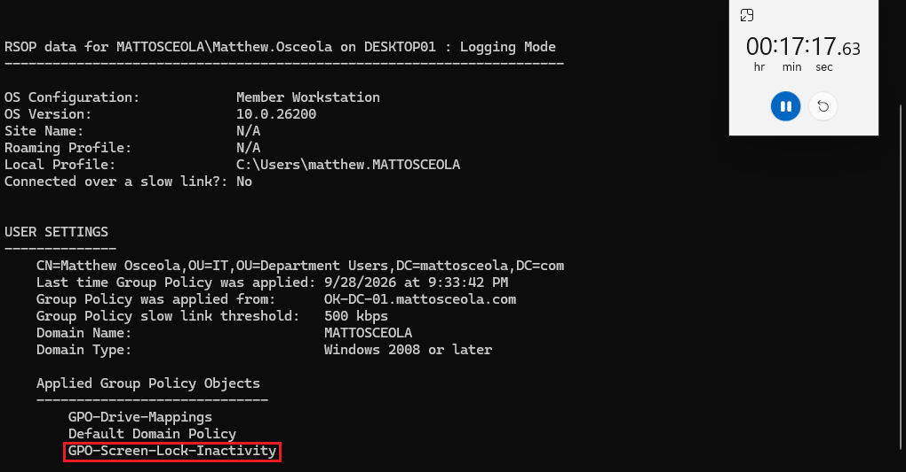
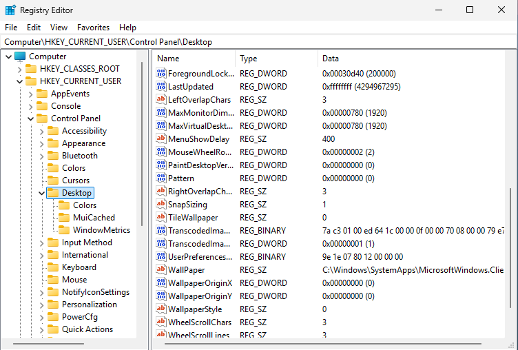
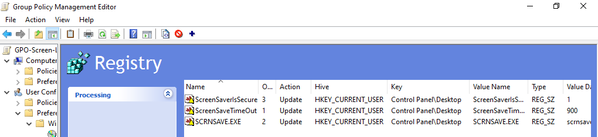
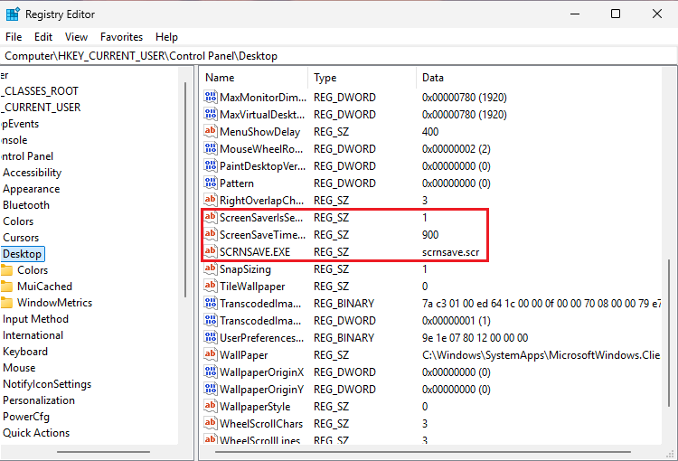

# Group Policy Troubleshooting

## Overview

Troubleshot a Group Policy enforcement issue in a Windows Server 2022 Active Directory environment after the Windows 11 client did not enforce the configured screen lock and inactivity settings, even though the Group Policy Object had applied successfully.

The issue was resolved by verifying the applied policy, validating the required registry values, and confirming the workstation security settings were enforced.

## Environment

* **Hypervisor:** Oracle VirtualBox
* **Server:** Windows Server 2022 (OK-DC-01)
* **Client:** Windows 11 Pro (Desktop01)
* **Domain:** mattosceola.com
* **Network:** Oracle VirtualBox NAT Network
* **Group Policy:** `GPO-Screen-Lock-Inactivity`

## Symptoms

* Screen lock and inactivity settings did not activate after the configured timeout.
* `gpresult /r` showed `GPO-Screen-Lock-Inactivity` as applied.
* The expected workstation security behavior was not being enforced.

## Investigation

Verified Group Policy application and reviewed the client configuration responsible for enforcing the screen saver settings.

### Client Checks

* Ran `gpresult /r` to verify `GPO-Screen-Lock-Inactivity` was applied.
* Confirmed the client remained joined to the `mattosceola.com` domain.
* Reviewed the screen saver registry values under `HKCU\Control Panel\Desktop`.

### Policy Checks

* Confirmed `GPO-Screen-Lock-Inactivity` remained linked to the correct Organizational Unit.
* Verified the GPO was enabled.
* Confirmed the configured screen lock settings matched the intended policy.

## Resolution

Resolved the issue by validating the required screen saver registry values and confirming the configured Group Policy settings were enforced.

The following registry values were verified:

* `SCRNSAVE.EXE`
* `ScreenSaverIsSecure`
* `ScreenSaveTimeOut`

## Validation

Verified the issue was resolved by confirming:

* `gpresult /r` continued to show `GPO-Screen-Lock-Inactivity` as applied.
* The required screen saver registry values were present.
* The workstation locked automatically after the configured inactivity timeout.
* The configured security policy was enforced successfully.

### Initial Issue

*The workstation remained unlocked after the configured inactivity timeout of 900 seconds or 15 minutes, even though the Group Policy was applied.*

### Investigation

*The screen saver registry values were reviewed and appeared to be missing.*

### Resolution

*The required screen saver registry values were added to the policy configuration.*

### Screenshot Validation

*Confirmed the workstation has received the screen saver registry values via the GPO.*

### Video Validation

*Changed the ScreenSaveTimeOut value to 10 from 900 to test that the GPO works as intended.*

