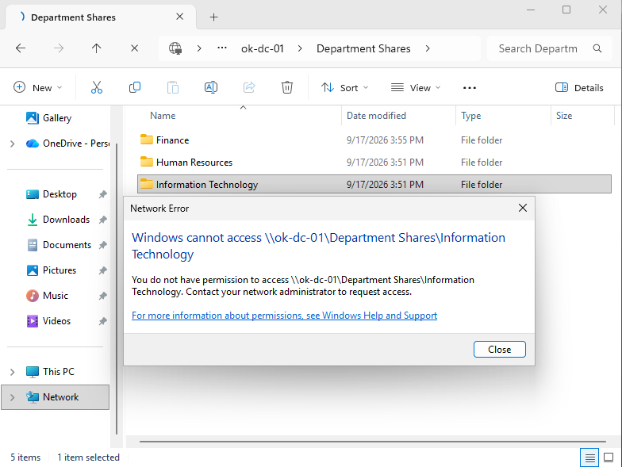
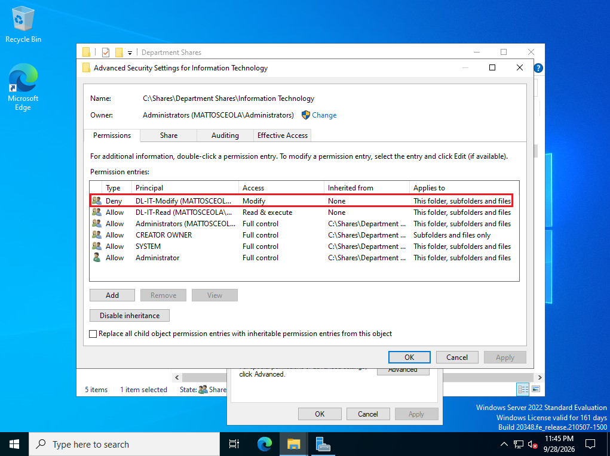
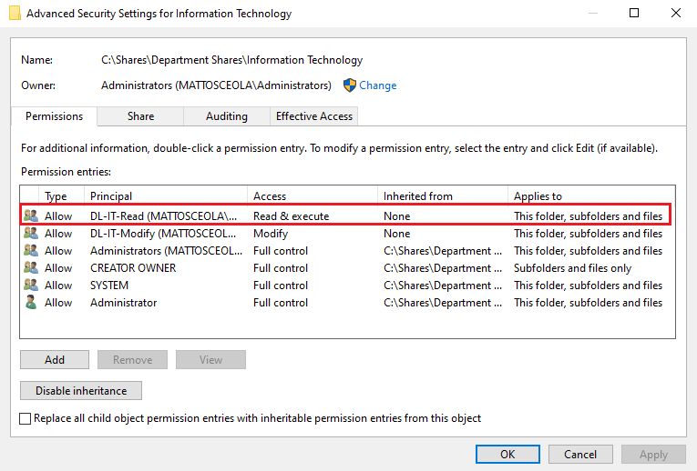
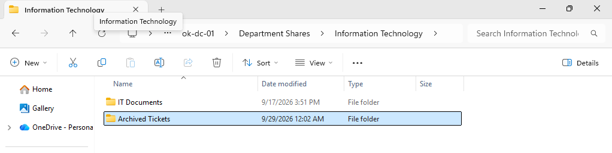

# NTFS Permissions Troubleshooting

## Overview

Troubleshot an NTFS permissions issue in a Windows Server 2022 Active Directory environment after a domain user was unable to access a folder they were expected to access based on their assigned permissions.

The issue was resolved by reviewing the user's group membership, verifying NTFS permissions and inheritance on the affected folder, correcting the permissions, and validating the user's access.

## Environment

* **Hypervisor:** Oracle VirtualBox
* **Server:** Windows Server 2022 (OK-DC-01)
* **Client:** Windows 11 Pro (Desktop01)
* **Domain:** mattosceola.com
* **Network:** Oracle VirtualBox NAT Network
* **File Server:** OK-DC-01

## Symptoms

* Domain user was unable to access the affected folder.
* User was expected to have access based on their assigned Active Directory group membership.
* NTFS permissions needed to be reviewed to determine why access was being denied.

## Investigation

Verified the user's Active Directory group membership and reviewed the NTFS permissions configured on the affected folder.

### Active Directory Checks

* Verified the affected user was a member of the expected security group.
* Reviewed the user's group membership in Active Directory Users and Computers.
* Confirmed the group was intended to provide access to the affected folder.

### NTFS Permission Checks

* Reviewed the **Security** tab of the affected folder.
* Checked the assigned users and security groups.
* Reviewed the configured **Allow** and **Deny** permissions.
* Checked whether permissions were being inherited from the parent folder.
* Identified the NTFS permission configuration responsible for the access issue.

## Resolution

Resolved the issue by correcting the NTFS permissions on the affected folder and ensuring the appropriate Active Directory security group had the required access.

The user's existing group membership was then used to provide the intended access without assigning unnecessary permissions directly to the user account.

## Validation

Verified the NTFS permissions were working correctly by confirming:

* The affected user was a member of the expected Active Directory security group.
* The appropriate security group was listed in the folder's NTFS permissions.
* The intended permissions were applied to the affected folder.
* The user could successfully access the folder after the permissions were corrected.
* Access was validated from the Windows 11 client.

### Initial Issue

*The domain user received an access-related error when attempting to access the affected folder.*

### Investigation

*The user's Active Directory group membership and the affected folder's NTFS permissions were reviewed to identify the source of the access issue.*

### Resolution

*The NTFS permissions were corrected so the appropriate Active Directory security group provided the intended access.*

### Validation

*The user successfully accessed the folder after the NTFS permissions were corrected.*

